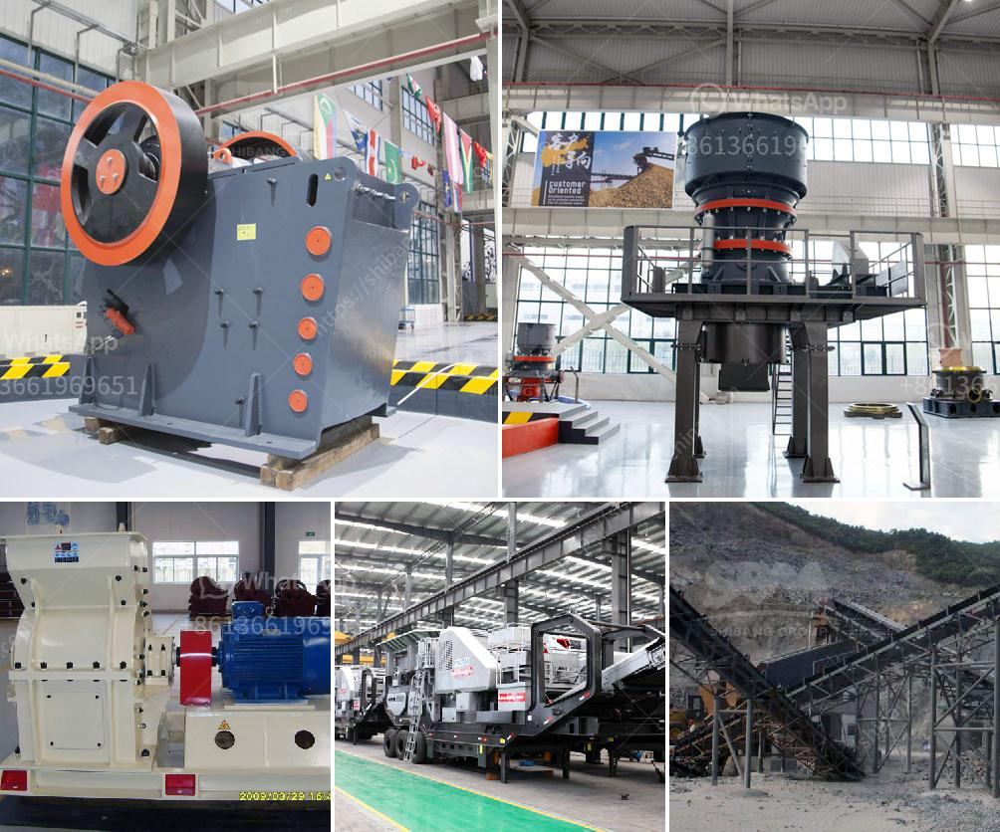

<h3>mobile crushing and screening plant for sale</h3>
The mobile crushing and screening plant for sale is crucial for construction projects in various fields. With the rapid development of urbanization, infrastructure projects such as highways, railways, and airports are springing up, which increases the demand for crushed materials. As a result, the mobile crushing and screening plant industry is witnessing tremendous growth. This article explores the importance of mobile crushing and screening plants, their benefits, and why they are a must-have for every construction site.

First and foremost, mobile crushing and screening plants offer versatility, flexibility, and ease of use. Being compact and lightweight, these plants can be easily transported to and from the construction site. They can be easily set up and dismantled, saving a significant amount of time and labor. Additionally, these plants can be operated remotely using advanced technology, which ensures safety during hazardous operations while minimizing the risk of accidents.

One of the primary advantages of mobile crushing and screening plants is their ability to produce high-quality aggregate materials. Whether it is gravel, crushed stone, or sand, the plants are designed to reduce the size of large rocks into smaller pieces. This process ensures that the final product is of the desired size and meets the specifications required for construction purposes. Moreover, these plants are equipped with efficient crushers, screens, and conveyors that help in producing consistent and uniform materials.

Another significant advantage of mobile crushing and screening plants is their cost-effectiveness. These plants are designed to improve the efficiency of the construction process by reducing transportation costs and minimizing material wastage. Rather than transporting the raw materials to a fixed plant, mobile plants can be placed directly at the construction site, allowing for immediate processing of the materials. This results in considerable savings in terms of transportation and storage costs.

Furthermore, mobile crushing and screening plants contribute to environmental sustainability. These plants operate on diesel engines or electricity, which reduces carbon emissions compared to traditional crushing plants. Moreover, they can be equipped with dust suppression systems, which minimize dust generation during the crushing and screening process. This helps in maintaining air quality and reducing the impact on the environment.

In conclusion, mobile crushing and screening plants are a game-changer for the construction industry. Their versatility, flexibility, and ease of use provide numerous benefits for construction projects. From saving time and labor to producing high-quality materials and ensuring environmental sustainability, these plants are a must-have on every construction site. As the demand for crushed materials continues to rise, investing in a mobile crushing and screening plant has become essential for construction companies. With their cost-effectiveness and efficiency, these plants are sure to revolutionize the way construction projects are carried out in the future.
<h3>Contact us</h3><ul><li><strong>Whatsapp:&nbsp;<a href="https://wa.me/8613661969651">+8613661969651</a></strong></li><li><a href="https://swt.shibang-china.com/?git&amp;zhl&amp;mobile crushing and screening plant for sale"><strong>Online Service(chat now)</strong></a></li></ul><h3>Related</h3><ul><li><a href='portable concrete crusher south africa.md'>portable concrete crusher south africa</a></li><li><a href='small impact gold mill australia.md'>small impact gold mill australia</a></li><li><a href='manufacturers of conveyor belts in malaysia.md'>manufacturers of conveyor belts in malaysia</a></li><li><a href='mobile stone crusher for concrete.md'>mobile stone crusher for concrete</a></li><li><a href='bentonite granual machine.md'>bentonite granual machine</a></li></ul>