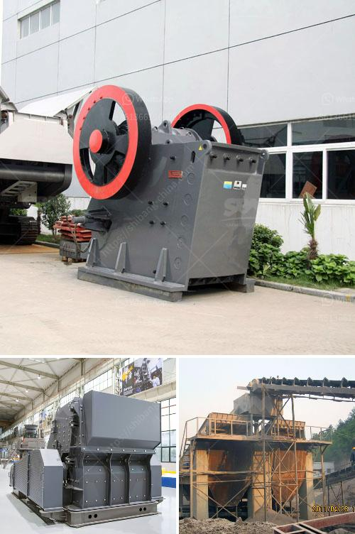

<h3>mobile crushing and screening plant</h3>
Mobile crushing and screening plant is a powerful equipment in the mining industry. It can be used to crush stones and rocks, and the powerful screening capabilities can produce different sizes of gravel, sand, and rock materials for various applications.

Where to find reliable mobile crushing and screening plant suppliers? Many websites and magazines publish plant supplier information, such as Alibaba, Aimix Group, and Betopper. These suppliers are committed to providing customers with high-quality and efficient equipment.

Firstly, let's talk about the advantages of a mobile crushing and screening plant. It has several significant benefits compared to traditional stationary crushers. The biggest advantage is its mobility. With the help of the wheeled chassis, this plant can be easily transported to any job site or location where it is needed. It eliminates the need for expensive transportation equipment and reduces installation time. This flexibility allows mining operations to adapt quickly to changing market demands and reduce downtime.

Another advantage is the high efficiency and low operating costs of the mobile crushing and screening plant. It utilizes fully hydraulic systems, including the feeder, crusher, conveyor, and optional equipment, which ensures fast loading, low maintenance, and maximum productivity. Additionally, it has a diesel engine or generator set to provide power supply, which saves energy and reduces costs.

One of the most crucial features of a mobile crushing and screening plant is its environmental friendliness. The plant is equipped with dust suppression equipment, which significantly reduces dust and noise pollution during operation. Moreover, its compact design and construction reduce the need for excessive ground excavation and minimize environmental impact. These factors make it an excellent choice for environmentally conscious mining companies.

In terms of applications, a mobile crushing and screening plant is suitable for various types of materials and can process rocks, ores, and construction waste. The plant can produce multiple sizes of gravel, sand, and rock materials used in construction, road building, and other industries. It is an ideal equipment for on-site crushing and screening operations.

In conclusion, a mobile crushing and screening plant provides a range of benefits for mining operations, including flexibility, high efficiency, low operating costs, environmental friendliness and a wide range of applications. It is an essential equipment in the mining industry and can be obtained from reliable suppliers.
<h3>Contact us</h3><ul><li><strong>Whatsapp:&nbsp;<a href="https://wa.me/8613661969651">+8613661969651</a></strong></li><li><a href="https://swt.shibang-china.com/?git&amp;zhl&amp;mobile crushing and screening plant"><strong>Online Service(chat now)</strong></a></li></ul><h3>Related</h3><ul><li><a href='kaolin calcination equipment.md'>kaolin calcination equipment</a></li><li><a href='large capacity jaw crusher machines sales to india.md'>large capacity jaw crusher machines sales to india</a></li><li><a href='quartz stone processing machine.md'>quartz stone processing machine</a></li><li><a href='ouedkniss station concassage.md'>ouedkniss station concassage</a></li><li><a href='new technology ball mill factories europe.md'>new technology ball mill factories europe</a></li></ul>