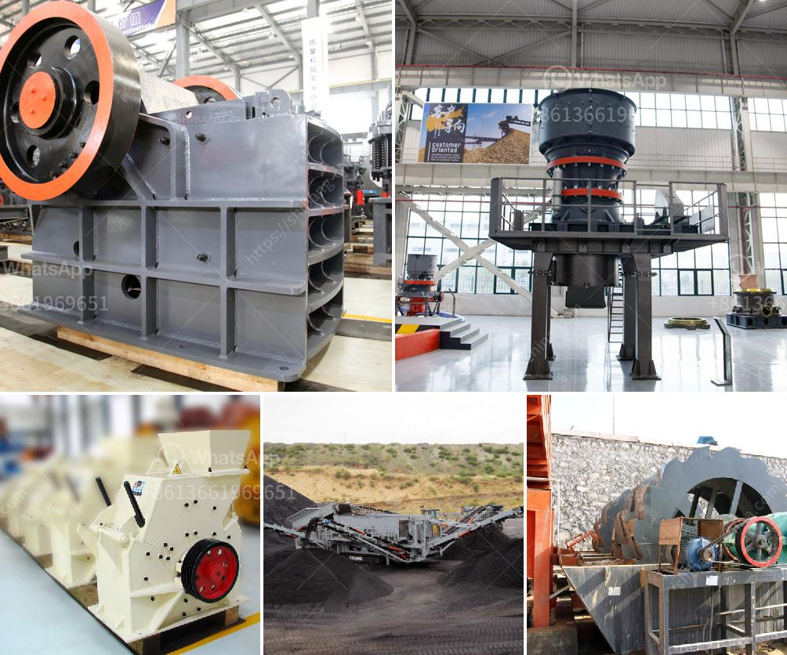

<h3>mobile crushing and screening plants</h3>
Mobile Crushing and Screening Plants: Revolutionizing the Mining and Construction Industry in the Modern Age

The mining and construction industry is undergoing a transformation, as companies are investing heavily in mobile crushing and screening solutions. As a reaction to the fast-growing demand for mining and construction services, companies are turning to portable crushers and screens to help them meet the demands. These versatile machines are revolutionizing the way mining and construction companies operate, bringing significant benefits in terms of efficiency and productivity.

Mobile crushing and screening plants are compact systems that used to crush raw materials which are extracting from quarries and to classify them into desired sizes. If desired, we may integrate washing systems on our mobile units as well. Recent years in consequence of the mobilization of the World, mobile crushers has been choosen instead of stationary plants with its easy installation and rapid displacement advantages. These preferences led to the accumulation of new suitable solutions to the condition of the facilities. New Generation Mobile Crushing and Screening Plant are more efficient, than classical plants. Per tonne production cost of the facility, according to the classical plants and mobile classical plants are at least 50% lower. New Generation Dragon Mobile Crushing and Screening Plant's service life is longer than classical plants and mobile classical plants.

Mobile Crushing and Screening Plant Factory, Aggregate ,Basalt ,Granite Mining Crusher Plant Factory ,Portable Stone Crusher , Screener Manufacturer. Mobile Crushing and Screening Plant Dragon 25. Maximum feeding size : 1500x1500 mm. Ideal feeding size: 0 - 1300 mm. Final size : 0 - 25 mm (0-5 mm , 5-12 mm ,12-25 mm or requested three types material and plus by-pass output production ). 

New Generation Dragon Crushing and Screening Plants, through high technology require minimum maintenance. It provides a low initial investment cost. A few machines with high ratios, which can be downloaded from the stone, a single crusher final product size can be reduced. Dragon Machinery, Granite Crushing Plant, Granite Crushing Plant in Palestine. Palestine has abundant of stones or mining. And the aggregates for construction in Africa always have a very good price. 

The granite is a kind of stone comprised with feldspar, quartz, black and white mica. The quartz engages about 10%-50%, and the feldspar engages about 2/3. So the granite is hard, with high intensity, anti-corrosion, Wear Resistance, Low water imbibition, it is a good materials for construction. In Palestine, one of our customers invest in the granite crushing line for construction aggregates. DRAGON designed a crushing line approximate 50-250tph for him. 

Mobile Crushing and Screening Plant Factory, Aggregate ,Basalt ,Granite Mining Crusher Plant Factory ,Portable Stone Crusher , Screener Manufacturer. Since its inception in the year 1979, Dragon has been serving to industry with over 200 people of staff, on production areas of 15000 m2 in Yazıbası / Izmir, 10.000 m2 in Ayrancilar / Izmir and 2.000 m2 in Ankara Showroom for more than 30 years.

Although Dragon Machinery has been in the industry for over three decades now, boasting a rich history and diverse selection of products, its mobile crushing and screening plants are widely preferred and highly sought after. Working with Dragon proves to be cost-effective and efficient, as its products provide customers with the ability to create accurate end products from any raw materials.

In conclusion, mobile crushing and screening plants have become a preferred option for mining and construction companies due to their numerous benefits and flexibility. Investing in portable crushers and screens can be a game-changer for companies, enabling them to ramp up production and boost profitability. With technological advancements and the constant drive for innovation, mobile crushing and screening plants will continue to revolutionize the mining and construction industry in the modern age.
<h3>Contact us</h3><ul><li><strong>Whatsapp:&nbsp;<a href="https://wa.me/8613661969651">+8613661969651</a></strong></li><li><a href="https://swt.shibang-china.com/?git&amp;zhl&amp;mobile crushing and screening plants"><strong>Online Service(chat now)</strong></a></li></ul><h3>Related</h3><ul><li><a href='harga mesin raymond mill indonesia.md'>harga mesin raymond mill indonesia</a></li><li><a href='mobile rock crushers in ghana.md'>mobile rock crushers in ghana</a></li><li><a href='machinery needed for limestone extraction.md'>machinery needed for limestone extraction</a></li><li><a href='primary and secondary crusher.md'>primary and secondary crusher</a></li><li><a href='aggregate quarry crusher operation cost.md'>aggregate quarry crusher operation cost</a></li></ul>