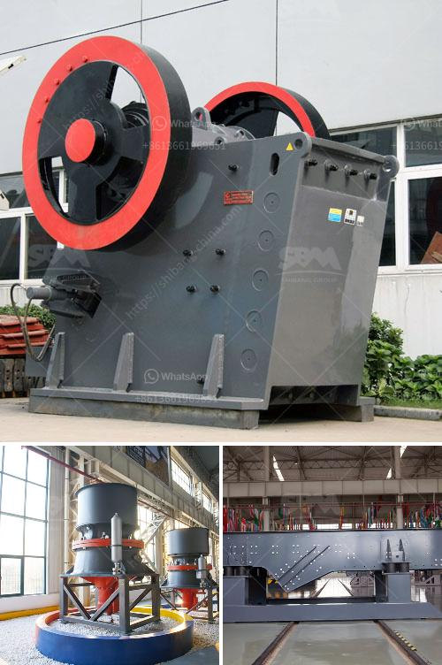

<h3>mobile crushing equipment for sale</h3>
Construction projects involve various processes, such as excavation, grading, and paving, which require high-quality materials. To meet these material demands, mobile crushing equipment has become increasingly popular in the construction industry. With its ability to move from one site to another, it provides contractors with an efficient solution for crushing and recycling materials on-site. This article will explore the benefits of mobile crushing equipment for sale and its significance in construction projects.

Mobile crushing equipment refers to portable stone crushers and screens that are designed to process rocks and construction waste into desired sizes. These machines are usually equipped with a primary crusher, secondary crusher, vibrating screens, and belt conveyors, all mounted on a mobile chassis. Their mobility allows them to be easily transported to different locations, making them ideal for construction sites.

One significant advantage of mobile crushing equipment is its flexibility. Contractors can choose the location where crushing operations are performed, eliminating the need to rely on fixed crushing plants. This flexibility saves time and reduces transportation costs, as materials can be processed on-site, reducing the need for hauling them to a centralized crushing plant.

Furthermore, mobile crushing equipment offers the ability to recycle materials directly at the construction site, contributing to a greener environment. Instead of disposing of construction waste in landfills, contractors can crush the waste material and reuse it as a base for roads, fill material, or as aggregates for new construction projects. This not only reduces the environmental impact but also helps in managing project costs.

Another benefit of mobile crushing equipment is its ability to improve project timelines. The mobility of these machines enables contractors to crush materials as needed, without delays caused by relying on external suppliers. Additionally, the production capacity of mobile crushing equipment is often higher than traditional fixed crushers, allowing for faster completion of projects. This efficient operation helps contractors meet tight construction schedules and deliver projects on time.

Mobile crushing equipment for sale also offers cost savings for contractors. Investing in portable crushers eliminates the need for multiple machines on site, reducing equipment and maintenance costs. Mobile units are also energy-efficient, with diesel-powered engines providing impressive fuel economy. The cost-effectiveness of mobile crushing equipment makes it a practical choice for contractors looking to maximize their return on investment.

In conclusion, mobile crushing equipment for sale has become essential in the construction industry due to its numerous advantages. Its flexibility, ability to recycle materials, and improved project timelines make it an efficient solution for crushing and processing materials on-site. Furthermore, it offers significant cost savings for contractors, making it a practical investment. With the growing demand for high-quality materials in construction projects, mobile crushing equipment provides a reliable and sustainable solution. Contractors must consider this equipment when planning their next construction project to optimize efficiency and reduce costs.
<h3>Contact us</h3><ul><li><strong>Whatsapp:&nbsp;<a href="https://wa.me/8613661969651">+8613661969651</a></strong></li><li><a href="https://swt.shibang-china.com/?git&amp;zhl&amp;mobile crushing equipment for sale"><strong>Online Service(chat now)</strong></a></li></ul><h3>Related</h3><ul><li><a href='second hand jaw crushers in holland.md'>second hand jaw crushers in holland</a></li><li><a href='limestone powder manufacture machine.md'>limestone powder manufacture machine</a></li><li><a href='new technology ball mill factories europe.md'>new technology ball mill factories europe</a></li><li><a href='gypsum router machines in uae.md'>gypsum router machines in uae</a></li><li><a href='stone grinding mill.md'>stone grinding mill</a></li></ul>