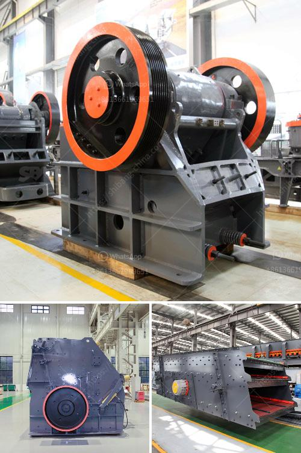

<h3>mobile crushing plant for rent in saudi arabia</h3>
Mobile crushing plant has been successfully applied in Saudi Arabia and has been widely used in construction waste recycling projects in the country. Mobile crushing plant can remove the obstacles of the crushing places and circumstances, and offer the high efficiency and low cost project plants for the client. However, for different requirements, different mobile crushing plants cannot be grouped together and are not suitable for a specific application.

Mobile crushing plant for rent in Saudi Arabia usually includes the primary crushing machine, the mobile cone crushing machine, the mobile impact crushing machine, and the mobile jaw crushing machine. It is suitable for contractors working on different projects in Saudi Arabia. Since nearly all of the minerals are non-renewable resources, it is very important for the energy supplier Saudi Arabia to develop high efficiency and low energy consuming equipment to fulfill the production needs.

Mobile crushing plant can process materials on site, which greatly reduce transportation cost of materials. Mobile crushing plant is widely used in the road and bridge construction, urban construction, metallurgy, energy, and other crushing and screening industries. The mobile crushing plant can process materials on site without moving the materials away from the site, which greatly reduces the transportation cost of materials. It has realized the combination of crushing and screening in one machine, bringing more economic benefits to customers.

Mobile crushing plant can crush the material on the spot, which avoids the step of transporting the materials away from the site to crushing plant. It greatly reduces the transportation cost of materials. SBM provides efficient mobile crushing plant for sale in Saudi Arabia. It is suitable for all kinds of rocks, such as granite, limestone, concrete, etc. It is widely used in mineral ore mining and processing, construction waste recycling, and construction aggregate production.

The mobile cone crushing plant can be utilized as a secondary, tertiary or quaternary crushing machine. It is designed for high productivity, unmatched flexibility and great performance. The mobile cone crushing plant can crush materials on site or somewhere near the work site. Features of Easy moving High efficiency mobile cone crushing plant includes high crushing ratio, high efficiency, low energy consumption and uniform product size. It optimized mobile crushing plant structure and simplified operation.

Mobile crushing plant for rent in Saudi Arabia is manufactured from Shanghai Xuanshi,It is widely used both domestic and abroad in metallurgy, architecture, roak making, chemistry and silicate industry. Mobile crushing plant is designed according to mineral properties and final products applications. SBM designs best crushing solution and provides whole range of mineral crushing plants in Saudi Arabia. With the development of mining machinery, there are more and more mobile crushing plant manufactures popping up in Saudi Arabia. Crusher plant manufacturer of SBM Company is good at stone mining crushing plant. Our crushing plant manufacturers design and sale jaw crusher, impact crusher, cone crushing plant, as mine mining equipment supply and price. Mobile crushers plant for iron ore industry for sale price in UAE. Double supply mobile crushing plant and the related wear parts for sale worldwide, Saudi Arabia, India, Germany, USA and mobile cone crusher has gained Click & Chat Now.
<h3>Contact us</h3><ul><li><strong>Whatsapp:&nbsp;<a href="https://wa.me/8613661969651">+8613661969651</a></strong></li><li><a href="https://swt.shibang-china.com/?git&amp;zhl&amp;mobile crushing plant for rent in saudi arabia"><strong>Online Service(chat now)</strong></a></li></ul><h3>Related</h3><ul><li><a href='roller mill grinding roller.md'>roller mill grinding roller</a></li><li><a href='dry process for gold recovery.md'>dry process for gold recovery</a></li><li><a href='jaw crusher 10 x 20.md'>jaw crusher 10 x 20</a></li><li><a href='aggregate production process.md'>aggregate production process</a></li><li><a href='crushing machine from china.md'>crushing machine from china</a></li></ul>