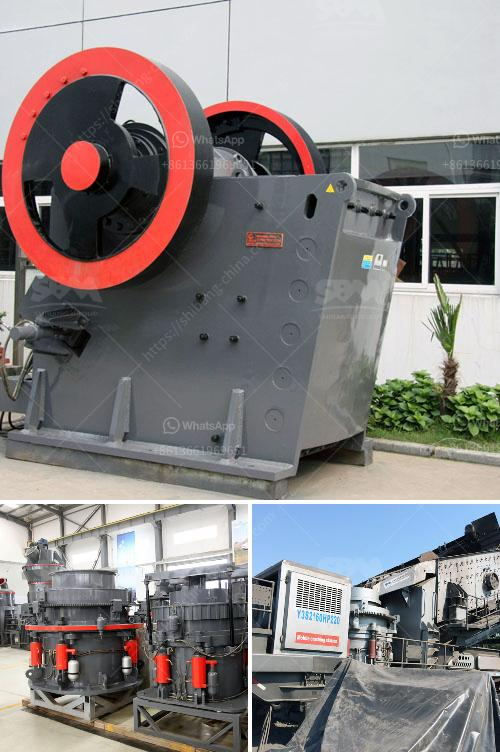

<h3>mobile diamond washing plant for sale</h3>
Diamonds, the precious gemstones that captivate and mesmerize, have long been sought after for their beauty and rareness. Their value and desirability in the market make diamond mining a lucrative industry. However, the extraction process requires specific equipment and facilities to ensure efficiency and productivity. One such piece of equipment that has revolutionized the diamond mining industry is the mobile diamond washing plant.

A mobile diamond washing plant is a compact and portable piece of equipment that is specifically used for alluvial diamond mining operations. These plants provide a highly efficient and effective diamond recovery solution that is ideally suited for all types of terrain and environmental conditions.

The primary purpose of a mobile diamond washing plant is to separate the diamonds from the gravel and soil in which they are embedded. This separation process happens in several stages. First, the extraction of diamonds from the earth is carried out through digging or dredging. The gravel and soil containing the diamonds are then transported to the washing plant, where they are subjected to a series of screens, jigs, and scrubbers.

The screens are used to separate the larger gravels from the smaller ones. The larger gravel is discarded, while the smaller-sized gravel and soil pass on to the next stage. In the jigs, heavy minerals such as diamonds and other precious stones settle at the bottom due to their high density, while the lighter materials are washed off. Finally, the scrubbers are used to remove any remaining dirt and clay particles from the diamond-rich concentrate.

The mobile diamond washing plant offers several advantages over traditional stationary plants. Firstly, its mobility allows for easy relocation and quick setup. This flexibility ensures that diamond mining operations can take place in multiple locations, maximizing the potential for finding valuable diamond deposits. Additionally, the compact design of the plant saves on space and reduces the need for extensive infrastructure.

Furthermore, the mobile diamond washing plant is often equipped with advanced technologies and features that enhance its efficiency and effectiveness. These may include automated processes, water recycling systems, and advanced screening and sorting capabilities. These technological advancements enable higher diamond recovery rates and minimize water consumption, making the plant more environmentally friendly and cost-effective.

For diamond miners and investors, the availability of mobile diamond washing plants for sale presents an excellent opportunity to invest in a profitable and sustainable venture. These plants offer an efficient means of diamond extraction and recovery, ensuring a high return on investment. Moreover, their mobility and advanced features make them suitable for both large-scale mining operations and small-scale artisanal mining operations.

In conclusion, the mobile diamond washing plant is a game-changer in the diamond mining industry. Its compactness, mobility, and advanced features make it the ideal solution for alluvial diamond mining operations. With its ability to efficiently separate diamonds from gravel and soil, this plant ensures maximum diamond recovery and profitability. For those looking to invest in the diamond mining industry, the availability of mobile diamond washing plants for sale presents a promising opportunity.
<h3>Contact us</h3><ul><li><strong>Whatsapp:&nbsp;<a href="https://wa.me/8613661969651">+8613661969651</a></strong></li><li><a href="https://swt.shibang-china.com/?git&amp;zhl&amp;mobile diamond washing plant for sale"><strong>Online Service(chat now)</strong></a></li></ul><h3>Related</h3><ul><li><a href='turkey cone crusher kenya.md'>turkey cone crusher kenya</a></li><li><a href='iron crushing equipment cost.md'>iron crushing equipment cost</a></li><li><a href='barite powder machine.md'>barite powder machine</a></li><li><a href='processing of copper crusher.md'>processing of copper crusher</a></li><li><a href='vrm cement plant.md'>vrm cement plant</a></li></ul>