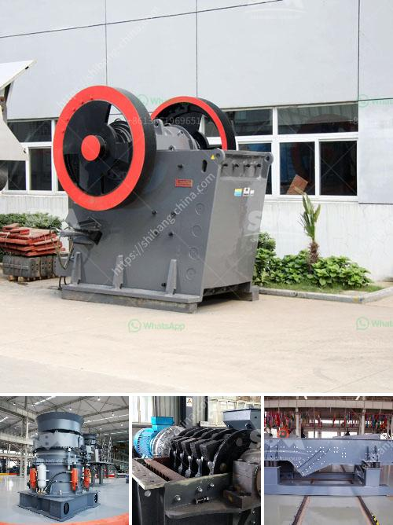

<h3>mobile dimension stone processing dressing cutting</h3>
Dimension stone refers to natural stone that is quarried and then cut and shaped into specific sizes or shapes for use in construction or building projects. Traditionally, dimension stone processing has been carried out in dedicated facilities, often located near the quarries, where large quantities of stone can be processed at a time. However, advancements in technology have now made it possible to carry out dimension stone processing on a mobile platform, providing increased efficiency and convenience.

Mobile dimension stone processing involves the use of cutting-edge equipment mounted on a mobile unit that can be easily transported to the quarry site. This eliminates the need for costly transportation of the stone to a processing facility, reducing both time and expenses. The mobile unit typically includes diamond wire saws, bridge saws, and other specialized cutting tools that can be used to cut and shape the stone to the desired specifications.

One of the key benefits of mobile dimension stone processing is the ability to carry out on-site dressing and cutting. This means that the stone can be processed immediately after it is quarried, without the need to transport it to a separate facility. This significantly reduces the lead time between quarrying and processing, allowing for faster completion of projects. Additionally, on-site processing eliminates the risk of damage during transportation, ensuring that the stone retains its quality and integrity.

The mobile dimension stone processing units are equipped with state-of-the-art technology that ensures precision and accuracy in cutting and shaping the stone. Diamond wire saws, for example, utilize a wire coated in diamond particles to slice through the stone with great precision. This advanced cutting method reduces wastage and allows for the extraction of maximum usable stone from each quarry block. Bridge saws, on the other hand, are used for detailed cutting and shaping of the stone, and can create intricate designs or finishes.

Mobile dimension stone processing is particularly beneficial for projects that require customized stone sizes or shapes. It allows architects and designers to have greater flexibility in incorporating the stone into their visions, as they can work directly with the mobile processing unit to achieve their desired specifications. This is especially useful for complex or irregularly shaped pieces of stone that may be difficult to cut and shape using traditional methods.

Furthermore, mobile dimension stone processing is environmentally friendly. By eliminating the need for transportation, it reduces carbon emissions and minimizes the impact on the environment. The advanced cutting technology used in mobile processing units also results in reduced wastage, as it allows for precise cutting and maximum utilization of the stone. This reduces the amount of stone material that goes to waste, making the overall process more sustainable.

In conclusion, mobile dimension stone processing has revolutionized the way natural stone is cut and shaped for construction and building projects. It offers increased efficiency, convenience, and flexibility compared to traditional processing methods. With its advanced technology and on-site capabilities, it allows for faster completion of projects and enables architects and designers to achieve their desired specifications. Moreover, it is environmentally friendly, reducing carbon emissions and minimizing wastage. As a result, mobile dimension stone processing is becoming increasingly popular in the construction industry.
<h3>Contact us</h3><ul><li><strong>Whatsapp:&nbsp;<a href="https://wa.me/8613661969651">+8613661969651</a></strong></li><li><a href="https://swt.shibang-china.com/?git&amp;zhl&amp;mobile dimension stone processing dressing cutting"><strong>Online Service(chat now)</strong></a></li></ul><h3>Related</h3><ul><li><a href='basalt crushing machinery processing line.md'>basalt crushing machinery processing line</a></li><li><a href='malaysia sand washer supplier.md'>malaysia sand washer supplier</a></li><li><a href='operation and operation of a jaw crusher.md'>operation and operation of a jaw crusher</a></li><li><a href='gold mining company tanzania.md'>gold mining company tanzania</a></li><li><a href='hammer mill manufacturer in tamilnadu.md'>hammer mill manufacturer in tamilnadu</a></li></ul>