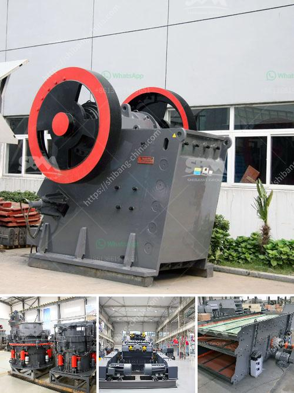

<h3>mobile gold refinery for sale</h3>
If you are a gold miner or investor looking for opportunities to expand your business, a mobile gold refinery might be just the answer. With the increasing demand for refined gold globally, a mobile refinery offers a convenient and cost-effective solution to process and purify raw gold on-site, eliminating the need for transportation and reducing refining costs.

A mobile gold refinery is a compact and self-contained unit that can be easily transported to various mining sites. It is equipped with state-of-the-art technology and machinery to extract impurities and transform raw gold into high-quality refined gold bars. The refinery can process a wide range of gold materials, including gold nuggets, dust, and scrap, ensuring maximum yield and value.

One of the major advantages of a mobile gold refinery is its flexibility and portability. It can be set up quickly at any mining location, eliminating the need for miners to transport their gold to distant refineries. This saves both time and money, making the refining process more efficient and profitable. Additionally, mobile refineries can be easily dismantled and transported to the next site, allowing miners to adapt to changing mining conditions and locations.

Furthermore, a mobile gold refinery offers an opportunity for miners to tap into the growing demand for responsibly sourced and sustainable gold. With increasing consumer awareness and stricter regulations on the gold supply chain, buyers are increasingly seeking gold that has been responsibly mined and refined. A mobile refinery enables miners to produce gold that complies with international standards and certifications, opening doors to premium markets and higher selling prices.

Investing in a mobile gold refinery can prove to be a lucrative business opportunity with significant returns. Not only does it offer a quick return on investment through savings on transportation and refining costs, but it also provides a competitive edge by offering flexibility and access to premium markets. As the global demand for refined gold continues to rise, owning a mobile gold refinery positions you to unlock the hidden potential of this precious metal and capitalize on the lucrative gold refining industry.
<h3>Contact us</h3><ul><li><strong>Whatsapp:&nbsp;<a href="https://wa.me/8613661969651">+8613661969651</a></strong></li><li><a href="https://swt.shibang-china.com/?git&amp;zhl&amp;mobile gold refinery for sale"><strong>Online Service(chat now)</strong></a></li></ul><h3>Related</h3><ul><li><a href='stone crushing prices.md'>stone crushing prices</a></li><li><a href='aggregates crushing plant in angat bulacan.md'>aggregates crushing plant in angat bulacan</a></li><li><a href='jaw crusher shanghai.md'>jaw crusher shanghai</a></li><li><a href='gold mining equipment plant for sales.md'>gold mining equipment plant for sales</a></li><li><a href='price of stone crushers in malaysia.md'>price of stone crushers in malaysia</a></li></ul>