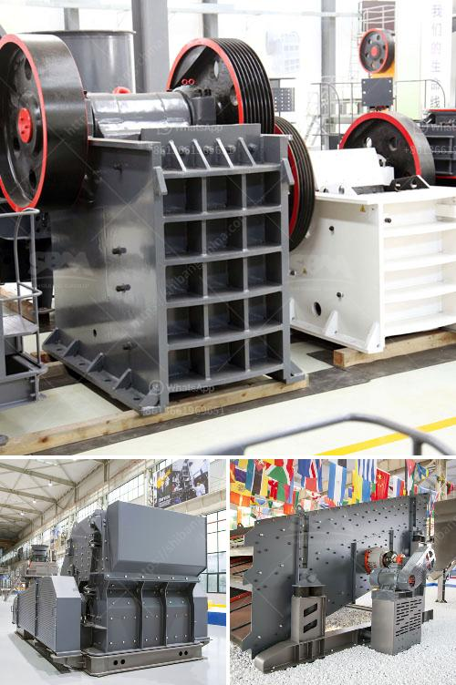

<h3>mobile jaw crusher</h3>
The mobile jaw crusher is the latest construction waste processing equipment that introduces the concept of using jaw crushing technology to do mining and processing tasks around construction sites. This rock crushing equipment has been widely used in many industries such as mining, metallurgy, building materials, highways, railways, water conservancy, and chemical industries.

One of the most outstanding features of the mobile jaw crusher is its strong mobility. It is especially suitable for construction waste processing with a small footprint and flexible movement. It can crush materials at the construction site, eliminating the need for transportation, thus saving a lot of transportation costs.

With the increasing development of urbanization, the amount of construction waste generated is rising year by year. Traditional construction waste treatment methods, such as landfill and incineration, have caused serious environmental pollution. In contrast, the mobile jaw crusher is an environmentally friendly construction waste processing equipment that can not only reduce construction waste generation but also recycle valuable resources.

The mobile jaw crusher can process materials such as granite, basalt, pebble, limestone, bluestone, calcium carbide, quartz stone, iron ore, and copper ore. The mobile jaw crusher is the first choice for primary crushing. It can be used alone or in combination with other crushing equipment such as impact crusher, cone crusher, sand making machine, etc. It is convenient to install, operate, and maintain.

The mobile jaw crusher is equipped with a market-leading hydraulic jaw crusher, which as the host crusher on the crawler chassis. The unit is integrated and the combination is reasonable and compact. Diesel electric drive mode is like plug-in hybrid drive of automobile, which is the development direction of crawler mobile crushing plant.

This kind of crawler type mobile jaw crusher crusher can be used as a multi-purposely integrated machine, with the maximum maneuverability and flexibility. It can be customized according to customers' requirements for raw materials, types and sizes of finished materials, and no matter what the environment, working conditions, and construction sites are, it can be freely combined.

In addition, the mobile jaw crusher has a large crushing ratio, uniform product size, and low operating cost. Its unique design structure ensures the finished product is cubic and the particle size is uniform. It can complete the crushing of large-sized limestone and the crushing of medium-sized dolomite and the like. It is widely used in various mining and construction industries.

As a leading mining machinery manufacturer, We, XYZ Company, have been committed to providing customers with the most comprehensive and cost-effective crushing equipment. The mobile jaw crusher with excellent performance is specially designed to solve the problem of construction waste disposal and make a green and sustainable resource utilization.

In conclusion, the mobile jaw crusher is an efficient crushing device and plays a pivotal role in the crushing process of construction waste. With the advancement in technology and the increase in construction waste generation, the importance of this mobile jaw crusher has been recognized by more and more people. So let's make good use of this mobile jaw crusher to achieve green construction waste disposal and create a better future for the environment.
<h3>Contact us</h3><ul><li><strong>Whatsapp:&nbsp;<a href="https://wa.me/8613661969651">+8613661969651</a></strong></li><li><a href="https://swt.shibang-china.com/?git&amp;zhl&amp;mobile jaw crusher"><strong>Online Service(chat now)</strong></a></li></ul><h3>Related</h3><ul><li><a href='flow chart gypsum production.md'>flow chart gypsum production</a></li><li><a href='crusher machine price.md'>crusher machine price</a></li><li><a href='listing price tons per hour screw conveyor.md'>listing price tons per hour screw conveyor</a></li><li><a href='cost quarry machines.md'>cost quarry machines</a></li><li><a href='copper grind powder mill machine.md'>copper grind powder mill machine</a></li></ul>