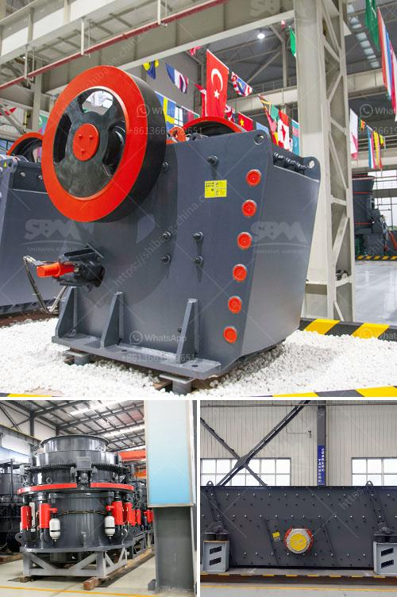

<h3>mobile rock crushers in ghana</h3>
Mobile rock crushers have become a popular option for many quarry sites across Ghana. As the demand for stones and aggregates continues to rise, so do the number of companies in Ghana that are investing in these crushing machines to meet this growing demand.

The machinery is mounted onto tracks or wheels for mobility, allowing them to move around the site and be transported easily to other locations. This flexibility is advantageous for companies operating in multiple quarry sites in Ghana, as it eliminates the need to invest in multiple fixed crushers.

One of the main advantages of using mobile rock crushers is that it allows for easy and immediate access to the material. Rather than having to rely on trucks to transport the materials to a stationary crusher, the mobile crusher can be brought to the quarry site itself. This eliminates the need for additional transportation costs and reduces the time required to process and produce the required aggregates.

Furthermore, mobile rock crushers are known for their high efficiency and productivity. With their powerful crushing capabilities, these machines can process large quantities of materials in a shorter period. This enables companies to meet their production targets more efficiently, thereby increasing their profitability.

In addition, mobile rock crushers are highly reliable and durable, making them suitable for the harsh conditions often found in quarrying sites. They are designed to withstand heavy usage and can easily handle various types of rocks and stones. This not only ensures the longevity of the machines but also provides the necessary assurance that they will function optimally to meet their intended purposes.

Another significant advantage of mobile rock crushers is their environmental friendliness. These machines are usually equipped with advanced technologies that minimize noise and dust emissions, which are common concerns in quarrying operations. This helps to protect the health and safety of the workers on-site and reduces the impact on the surrounding environment.

Furthermore, the use of mobile rock crushers can also contribute to sustainable development in Ghana. By employing these machines, companies can efficiently utilize the available resources, minimizing waste and reducing the need for new quarries. This promotes a more sustainable approach to extractive industries, ensuring the long-term viability of Ghana's natural resources.

In conclusion, mobile rock crushers have revolutionized the quarrying industry in Ghana. With their versatility, efficiency, and environmental friendliness, these machines have become indispensable tools for companies looking to meet the increasing demand for aggregates. The ability to move and process materials on-site has greatly improved productivity while reducing costs and environmental impact. Furthermore, mobile rock crushers play a crucial role in promoting sustainable development by optimizing resource utilization and minimizing waste. As Ghana continues to experience growth in its infrastructure and construction sectors, the demand for mobile rock crushers is expected to further increase.
<h3>Contact us</h3><ul><li><strong>Whatsapp:&nbsp;<a href="https://wa.me/8613661969651">+8613661969651</a></strong></li><li><a href="https://swt.shibang-china.com/?git&amp;zhl&amp;mobile rock crushers in ghana"><strong>Online Service(chat now)</strong></a></li></ul><h3>Related</h3><ul><li><a href='rotary kiln producers in indonesia.md'>rotary kiln producers in indonesia</a></li><li><a href='stone quarry crusher machines.md'>stone quarry crusher machines</a></li><li><a href='stone crushing company in philippines.md'>stone crushing company in philippines</a></li><li><a href='crushers for phonolite.md'>crushers for phonolite</a></li><li><a href='used stone crusher mashines usa.md'>used stone crusher mashines usa</a></li></ul>