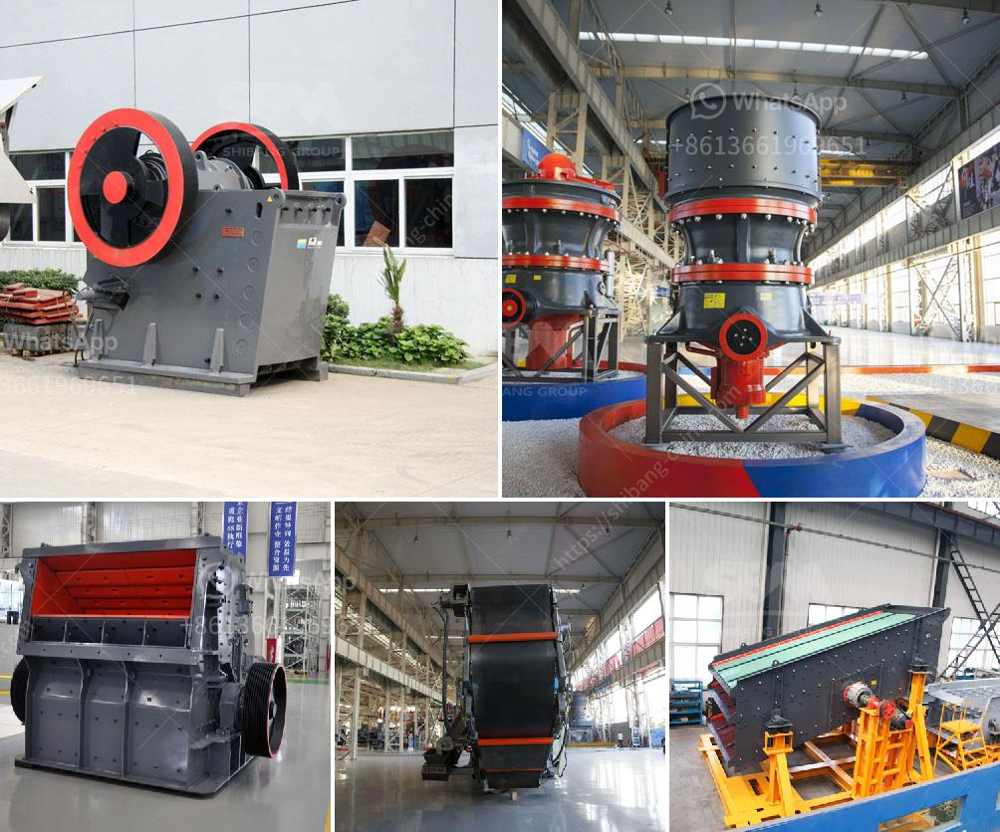

<h3>mobile stone crusher for concrete</h3>
Mobile stone crusher has become a necessity for construction projects due to its ability to perform efficiently in various terrains and ease of use. Thanks to the powerful machinery, it can process rocks and concrete into small-sized stones which are vital for many industries.

The mobile stone crusher is a machine that often wears high-strength grinding, but if it does not do well before the use of the mobile stone crusher, it will affect the production and, in serious cases, the mobile crusher Damaged, causing serious safety accidents. Therefore, in the use of the necessary preparatory tasks, we can at a certain level of familiarity with its performance and characteristics, to help users conduct the necessary training before the operation.

One of the primary benefits of a mobile crushing plant is the fact that it can crush materials on site, which removes the requirement for transporting materials to a crushing plant and back. Instead, the mobile crusher can transport the finished product itself or easily transfer it to a truck or container. This can represent a significant saving since transport takes a large proportion of costs.

Additionally, by using a mobile crusher, you can reduce your transportation costs and save energy. With a mobile crusher, you can always rest assured that your business is crushing on the go, and that it will save you time and money. For some, it will be a lifelong dream to own a quarry. However, it is important to remember that your ultimate goal is to make the best profit possible. To accomplish this, you need to have access to a high-quality stone crusher for preparing the required groundwork.

In the early stages, the mobile crusher was only used in the demolition and recycling industries. With the development of technology, the crawler type mobile stone crusher has become attractive. Compared with the traditional fixed crusher, the mobile crushing station equipment does not require a specific site layout and can be moved at any time. The mobile crushing station can freely convert the crushing business into various functions, such as crushing and screening.

The mobile jaw crusher can process materials such as granite, basalt, ore, tailings, construction waste, etc., and can be used in mining, quarry, mixing station, highway, railway, construction, etc. The coarse particles processed by the mobile jaw crusher are mostly used in civil construction. The finely crushed concrete products are used in production of highway pavement materials, roadbed materials, and pipeline materials, which has a very wide application range.

With the accelerating process of urbanization, serious construction waste processing problem is becoming more prominent. Single-stage jaw crusher is kind of jaw crusher with function of "one stage realizes multi-stage crushing". It is new generation of mining machine researched and developed by DSMAC, and it has features of one machine with multiple stages crushing, low investment cost, and high economic benefits.

In conclusion, the mobile stone crusher for concrete recycling is indeed a good helper for the disposal of construction waste. So, how much do you know about portable stone crushers? Besides the above mentioned, all kinds of stone crushers and wear parts can be customized according to your diverse needs. Even though it may not be the most glamorous construction material, concrete is indeed extremely important. Concrete plays an integral part in building our communities and infrastructure. The mobile stone crusher plant is a valuable piece of equipment for any business.

Overall, renting a mobile crusher is an optimal option for recycling concrete, as it can be brought to the job site as needed, allowing for efficient processing while reducing the waste burden on landfill sites.
<h3>Contact us</h3><ul><li><strong>Whatsapp:&nbsp;<a href="https://wa.me/8613661969651">+8613661969651</a></strong></li><li><a href="https://swt.shibang-china.com/?git&amp;zhl&amp;mobile stone crusher for concrete"><strong>Online Service(chat now)</strong></a></li></ul><h3>Related</h3><ul><li><a href='crush machine price in pakistan.md'>crush machine price in pakistan</a></li><li><a href='how to make an industrial stone crusher.md'>how to make an industrial stone crusher</a></li><li><a href='ball mill manufacturer in inammedabad.md'>ball mill manufacturer in inammedabad</a></li><li><a href='find fine jaw crusher in china.md'>find fine jaw crusher in china</a></li><li><a href='buy crusher of impact of 10 tph.md'>buy crusher of impact of 10 tph</a></li></ul>