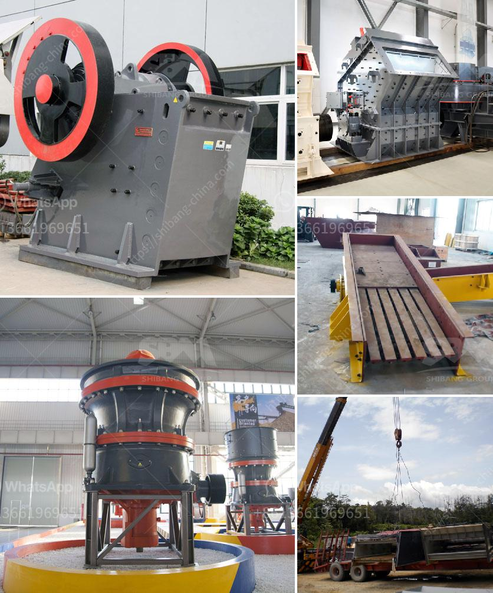

<h3>mobile stone crusher machine price and cost</h3>
Mobile stone crusher machine is a kind of stone crusher series and also the most common crusher in the stone crusher series. Mobile crusher is adaptable to all mobile crushing needs, mobile crusher sets up a new range of business opportunities for contractors, quarry operators, recycling and mining applications. The mobile crusher plant for stone crushing features low transportation cost, flexible configuration, easy maintenance, etc.

The mobile crusher plant can not only work independently, but also be combined with other machines in a production line. There are mainly several kinds of mobile crusher plant, that is jaw mobile crusher plant, cone mobile crusher plant and impact mobile crusher plant.

SBM has pioneered the development of complete mobile crushing and screening plants. We have delivered thousands of mobile crushing and mining plants for contract crushing and screening, quarry operations, minerals processing and recycling sites. Our mobile stone crusher machine is availabe with different models and specifications. It can be equipped with jaw crusher, impact crusher and cone crusher, and widely applied in primary, secondary and tertiary crushing applications.

The mobile stone crusher machine offers a crusher output of up to 400 t/h. High capacity and a good crushing ratio are ensured by the jaw crusher that boasts a high-quality steel structure for long life, together with a modular, bolted design for reduced metal fatigue and greater reliability. Mobile Impact Crushing Machine

The PFW series mobile impact crushing machine is integrated mobile equipment composed by the feeder, impact crusher, conveyor belts etc.. It uses sophisticated manufacturing technology and selects best quality high chrome plate hammer and wear-resistant liner plate, to make large crushing ratio.

The portable cone crusher attributes higher capacity and reliability, also to top top quality and cubical finish items and also low put on part expenses. This new cone plant is created for effective secondary and fine crushing and screening applications, where high throughput, a high-quality end item transport dimensions are required.

SBM has pioneered the development of complete mobile crushing and screening plants. We have delivered thousands of mobile crushing and mining plants for contract crushing and screening, quarry operations, minerals processing and recycling sites.

It has been the world favorite primary crushing plant in mining, construction, quarry, and recycling applications. Impact crusher is specific tool used to break down the large rocks into smaller pieces. Efficient impact crusher operation can improve the whole production line efficiency.

SBM is a world leader in design and innovation within the crushing and mining industry. We have developed a series of mobile crushing plant for marble, limestone, gypsum, dolomite, quartz and construction waste. SBM provides various types of mobile stone crusher plant for sale. The mobile stone crusher plant can be equipped with different types of crushers such as a jaw crusher, a cone crusher, a impact crusher etc. It can be exchanged according to the specific production requirements of customers and various installation conditions. Flexible maneuverability combined with high reliability and security make the mobile crusher the ideal choice for mining operations.
<h3>Contact us</h3><ul><li><strong>Whatsapp:&nbsp;<a href="https://wa.me/8613661969651">+8613661969651</a></strong></li><li><a href="https://swt.shibang-china.com/?git&amp;zhl&amp;mobile stone crusher machine price and cost"><strong>Online Service(chat now)</strong></a></li></ul><h3>Related</h3><ul><li><a href='prices for stone crushing machine zimbabwe.md'>prices for stone crushing machine zimbabwe</a></li><li><a href='100tph jaw crusher and ball mill.md'>100tph jaw crusher and ball mill</a></li><li><a href='chrome ore refinery processing plant.md'>chrome ore refinery processing plant</a></li><li><a href='mobile crusher debris.md'>mobile crusher debris</a></li><li><a href='business plan of stone crushing companies.md'>business plan of stone crushing companies</a></li></ul>