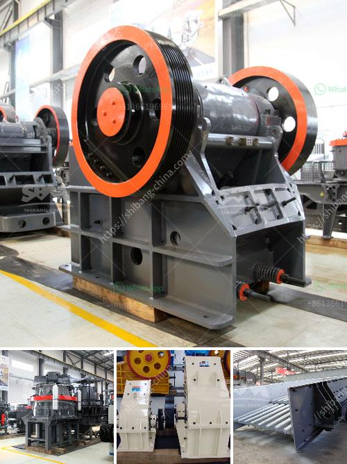

<h3>mobile stone crushers south africa</h3>
Mobile stone crushers are a type of stone crusher that is designed to crush large rocks into small pieces, making it easier to transport or handle. These machines are sold in many countries, including South Africa, where they are used in various mining and construction industries. Today, we will be focusing on the mobile stone crushers in South Africa.

South Africa has successfully established itself as one of the leading countries with rich mineral resources. This has led to many mining companies and contractors setting up their bases in the country. However, mining and construction activities require the use of heavy machinery, including stone crushers.

Mobile stone crushers in South Africa are typically used as primary crushers, or the first step in the process of reducing rock. They typically crush using compression. The rock is dropped between two rigid pieces of metal, one of which then move inwards towards the rock, and the rock is crushed because it has a lower breaking point than the opposing metal piece.

Mobile stone crushers in South Africa offer great mobility and flexibility, which is ideal for contractors and quarry operators alike. These machines can be classified into two main types, the tracked mobile crusher and the wheeled mobile crusher. These choices provide optimal productivity and ease of transportation.

With the increasing demand for mobile stone crushers in South Africa, the market for this machinery is expanding. According to a recent study by Grand View Research, the South African mobile crushers and screeners market is expected to reach $2.4 billion by 2027, growing at a CAGR of 4.7% over the forecast period.

The key players in the South African mobile stone crushers market include Terex Corporation, Sandvik AB, Metso Corporation, Astec Industries, Inc., and Komatsu Ltd.

To conclude, mobile stone crushers are a crucial type of machinery used in the mining and construction industries. They are highly efficient in crushing large rocks into smaller pieces, allowing for easy transportation and handling. Furthermore, with the increasing demand for mobile stone crushers in South Africa, the market for this machinery is expected to grow significantly in the coming years.
<h3>Contact us</h3><ul><li><strong>Whatsapp:&nbsp;<a href="https://wa.me/8613661969651">+8613661969651</a></strong></li><li><a href="https://swt.shibang-china.com/?git&amp;zhl&amp;mobile stone crushers south africa"><strong>Online Service(chat now)</strong></a></li></ul><h3>Related</h3><ul><li><a href='jual jaw crusher second hand.md'>jual jaw crusher second hand</a></li><li><a href='magnetita mineral cribado cantera planta trituradora.md'>magnetita mineral cribado cantera planta trituradora</a></li><li><a href='used jaw crushers with price in pakistan.md'>used jaw crushers with price in pakistan</a></li><li><a href='mobile diamond washing plant for sale.md'>mobile diamond washing plant for sale</a></li><li><a href='quartz powder manufacturing machinery.md'>quartz powder manufacturing machinery</a></li></ul>