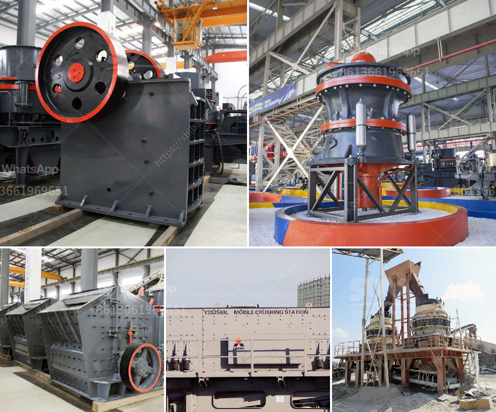

<h3>mobile stone crushing machine for sale</h3>
Mobile stone crushing machine is usually a handy machine that allows you to crush rocks into different sizes. This machine is tough and powerful, making it ideal for both on-site and off-site crushing operations. Furthermore, it is adaptable to different types of materials, whether it be granite, basalt, limestone, or iron ore.

One of the key advantages of a mobile stone crushing machine is its flexibility. It can be maneuvered around various job sites promptly and easily, and it can be set up for operation within minutes. In addition, it eliminates the need for costly transportation of raw materials, as it can crush them on-site. This significantly reduces the overall operating cost of crushing projects.

Another advantage of this machine is its high crushing efficiency. With a mobile stone crushing machine, large rocks can be quickly and efficiently broken down into smaller, more manageable sizes. This allows for easier transportation and further processing. Moreover, the crushed materials can be reused in other construction projects, reducing waste and saving valuable resources.

For those in the construction industry, mobile stone crushing machines offer a practical and cost-effective solution. Having the ability to crush stones on-site eliminates the need for excessive transportation costs and reduces the environmental impact associated with transporting materials. This machine is, therefore, an excellent investment that can yield significant long-term benefits.

When considering purchasing a mobile stone crushing machine, there are several factors to consider. Firstly, it is important to ensure that the machine is capable of handling the desired capacity and size of the rocks you intend to crush. Additionally, the machine should be durable and able to withstand the rough conditions of construction sites.

It is also crucial to select a machine from a reputable manufacturer or dealer. This guarantees that the machine is of high-quality and will perform reliably over an extended period. Furthermore, reputable manufacturers often provide excellent after-sales services, such as maintenance and spare parts, ensuring the longevity and optimal performance of the machine.

In conclusion, a mobile stone crushing machine is a versatile and beneficial tool for on-site and off-site crushing operations. It offers high crushing efficiency, reduces transportation costs, and promotes the reuse of materials. As a result, it is widely used in various construction projects. When selecting a machine, it is critical to consider factors such as capacity, durability, and the reputation of the manufacturer. By making the right choice, you can enjoy the many benefits of mobile stone crushing machines for years to come.
<h3>Contact us</h3><ul><li><strong>Whatsapp:&nbsp;<a href="https://wa.me/8613661969651">+8613661969651</a></strong></li><li><a href="https://swt.shibang-china.com/?git&amp;zhl&amp;mobile stone crushing machine for sale"><strong>Online Service(chat now)</strong></a></li></ul><h3>Related</h3><ul><li><a href='limestone grinding system.md'>limestone grinding system</a></li><li><a href='gypsum crushing machine.md'>gypsum crushing machine</a></li><li><a href='plamnta mobile stone crusher.md'>plamnta mobile stone crusher</a></li><li><a href='renta de cribas vibratorias en mexico.md'>renta de cribas vibratorias en mexico</a></li><li><a href='vibratory screen design.md'>vibratory screen design</a></li></ul>