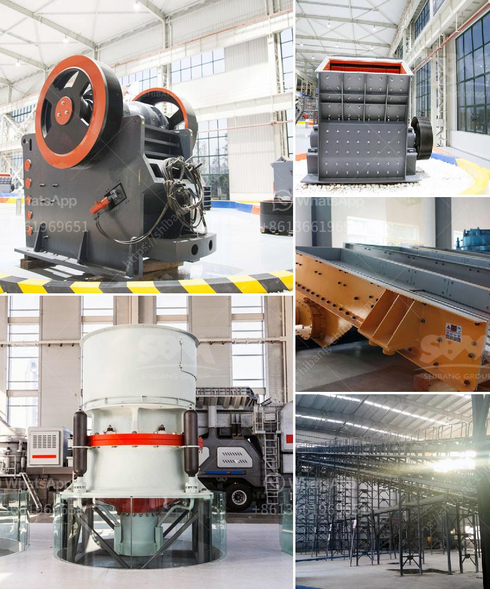

<h3>mobile stone crushing machine in america</h3>
Mobile stone crushing machine is commonly used for crushing and processing materials in the mining, construction, and quarrying industries. Mobile stone crusher machines are driven directly by their own power, which greatly reduces the cost of operation and improves the flexibility of the equipment.

In recent years, with the development of the urbanization process, the demand for sand and gravel aggregates has been increasing, which has led to a surge in the production of mobile stone crushing machines. These machines are widely used in various fields such as construction waste recycling, engineering construction, earth and stone engineering, and urban infrastructure construction. They have become an integral part of the production and construction processes.

One of the key advantages of mobile stone crushing machines is their high efficiency and reliability. They can process a wide range of materials, including construction waste, concrete, asphalt, natural rock, and more. The mobile crushing machines are equipped with advanced crushing technology, which makes the final products more uniform and of higher quality.

Moreover, these machines are designed to be compact and easy to transport. They can be easily moved from one site to another, allowing for flexible and efficient operation. This is particularly beneficial for construction projects that require the crushing of materials at multiple locations. The mobility of mobile stone crushing machines also enables them to be used in remote areas where traditional crushing equipment may not be easily accessible.

Another advantage of mobile stone crushing machines is their environmental friendliness. With the increasing emphasis on environmental protection, these machines are equipped with dust suppression systems to reduce the generation of dust and noise during operation. Additionally, they are powered by low-emission engines, which helps to reduce air pollution. This makes them a sustainable and green choice for crushing and processing operations.

In America, the demand for mobile stone crushing machines is on the rise due to the rapid growth of the construction industry. However, for entrepreneurs and construction companies, it is important to choose the right machine for their specific needs. Factors to consider include the type and size of the material to be processed, the required output size, and the production capacity.

There are several reputable manufacturers and suppliers of mobile stone crushing machines in America. These companies offer a wide range of models and configurations to suit different requirements. Additionally, they provide after-sales support and technical assistance to ensure the smooth operation of the machines.

In conclusion, mobile stone crushing machines have revolutionized the mining, construction, and quarrying industries. Their high efficiency, reliability, and environmental friendliness make them a preferred choice for crushing and processing operations. Entrepreneurs and construction companies in America can benefit from the wide range of machines available in the market, which can be customized to meet their specific needs. With the right machine, they can increase productivity, reduce costs, and contribute to sustainable development.
<h3>Contact us</h3><ul><li><strong>Whatsapp:&nbsp;<a href="https://wa.me/8613661969651">+8613661969651</a></strong></li><li><a href="https://swt.shibang-china.com/?git&amp;zhl&amp;mobile stone crushing machine in america"><strong>Online Service(chat now)</strong></a></li></ul><h3>Related</h3><ul><li><a href='impact crusher for sale in kenya.md'>impact crusher for sale in kenya</a></li><li><a href='diesel grinding mills musina south africa.md'>diesel grinding mills musina south africa</a></li><li><a href='stone crushing industry tanzania.md'>stone crushing industry tanzania</a></li><li><a href='concrete crusher for rent qatar.md'>concrete crusher for rent qatar</a></li><li><a href='how to make an industrial stone crusher.md'>how to make an industrial stone crusher</a></li></ul>