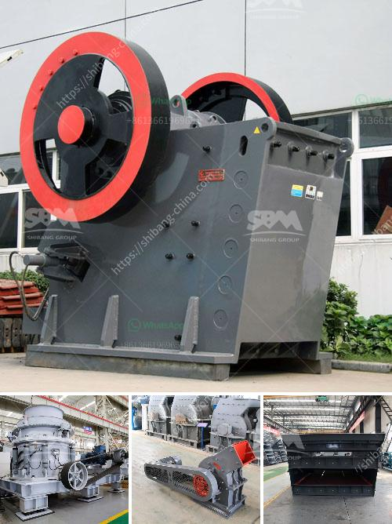

<h3>mobile stone jaw crusher equipment</h3>
Mobile stone jaw crusher equipment is mainly used for primary crushing of materials, and the mobile jaw crusher is widely used in mining, metallurgy, building materials, roads, railways, water conservancy and chemical industries, etc. The crusher takes large pieces of material, rocks, ore, concrete, or other materials, and crushes them down to smaller sizes for further processing in a ball mill or hammer mill, or for use in ballast or fill applications.

Mobile jaw crushers are similar in design and function to stationary crushers. They are compactly designed to provide the same or even greater mobility as traditional jaw crushers. These machines are designed to crush hard and abrasive materials, including granite, basalt, limestone, quartzite, iron ore, and other minerals. The mobile stone jaw crusher equipment offers a crusher output of up to 400 t/h. High capacity and a good crushing ratio are ensured by the jaw crusher that boasts a high-quality steel structure for long life, together with a modular, bolted design for reduced metal fatigue and greater reliability.

Mobile stone jaw crusher equipment has a large crushing ratio with high performance price ratio. The size of the crusher inlet is 1,100 × 700 mm, and the maximum feed size is 600 mm, which can meet different customer needs. The discharge port adjustment range of the European version of the jaw crusher is 50-160 mm, which can meet the requirements of different users.

Mobile stone jaw crusher equipment is mainly composed of vibrating feeder, jaw crusher, belt conveyor, and vibrating screen. When producing 50-600 tons of jaw crusher, it mainly consists of a vibrating feeder GZD850 3000, a jaw crusher PE400×600, a belt conveyor, a central control system, and a power control system. The movable jaw plate can oscillate up and down to transmit forward and backward crushing force to the crushed material effectively. The structure design of the jaw plate of the mobile jaw crusher is very reasonable, and the jaw plate is made of high-strength manganese steel materials, which makes the jaw crusher have good wear resistance and long service life.

In summary, the mobile stone jaw crusher equipment can be classified into primary crushing, secondary crushing, and tertiary crushing machines according to production capabilities (following factors including particle size, finished products' shape, required tertiary crushing, etc.) and for different applications (they are primarily used in mining, quarrying, recycling, asphalt and concrete production, etc.). Mobile jaw crushers are also helpful for recycling purposes, being able to quickly and easily move between sites for efficient stockpiling of materials or fitting into tight spaces. With a variety of models available, mobile stone jaw crushers are suitable for small-scale to large-scale operations. They are reliable and easy to maintain, making them a practical choice for a range of crushing tasks.
<h3>Contact us</h3><ul><li><strong>Whatsapp:&nbsp;<a href="https://wa.me/8613661969651">+8613661969651</a></strong></li><li><a href="https://swt.shibang-china.com/?git&amp;zhl&amp;mobile stone jaw crusher equipment"><strong>Online Service(chat now)</strong></a></li></ul><h3>Related</h3><ul><li><a href='design and sizing of a gold processing plant pdf.md'>design and sizing of a gold processing plant pdf</a></li><li><a href='alluvial chrome wash plant in the usa.md'>alluvial chrome wash plant in the usa</a></li><li><a href='dolomite beneficiation process.md'>dolomite beneficiation process</a></li><li><a href='differnce between raw mill and ball mill.md'>differnce between raw mill and ball mill</a></li><li><a href='gypsum chromium limestone mining.md'>gypsum chromium limestone mining</a></li></ul>