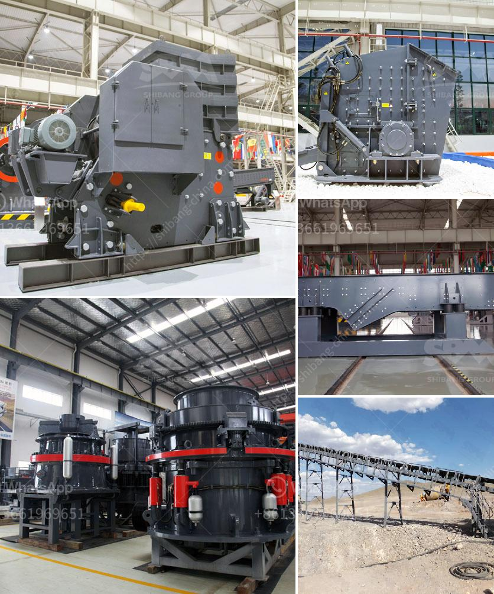

<h3>mobile tracked crushers</h3>
Mobile tracked crushers are a crucial component in the field of construction and demolition waste recycling. These compact crushing machines are extremely versatile and can be used for processing various types of materials, including asphalt, concrete, and bricks, among others.

The concept of mobile tracked crushers dates back to the early 20th century when the first jaw crushers were introduced. These machines revolutionized the construction industry by allowing for on-site crushing and recycling of materials, eliminating the need for traditional crushing plants and transportation of the waste to a central processing facility.

One of the key advantages of mobile tracked crushers is their mobility. Equipped with tracks or wheels, these crushers can be easily transported from one site to another, making them ideal for use in remote locations or on sites with limited access. This versatility enables contractors to move the crushers closer to the material source, reducing transportation costs and improving overall efficiency.

Another notable advantage of mobile tracked crushers is their ability to handle a wide range of materials. From recycling construction and demolition waste to processing natural aggregates, these crushers are designed to provide high-quality end products. Depending on the model, they can produce various sizes of crushed materials, making them suitable for different applications, such as road construction, landscaping, or filling.

Furthermore, mobile tracked crushers offer advanced features and technologies to enhance productivity and performance. Many models are equipped with remote control systems, allowing operators to monitor and control the crushers from a safe distance. Additionally, some crushers incorporate intelligent automation systems that optimize production and reduce downtime.

In conclusion, mobile tracked crushers are a game-changer in the construction and demolition waste recycling industry. Their mobility, versatility, and advanced features make them an essential tool for contractors looking to maximize efficiency and minimize waste. With the increasing focus on sustainable practices, these crushers play a vital role in reducing the environmental impact of construction activities while also providing significant cost benefits.
<h3>Contact us</h3><ul><li><strong>Whatsapp:&nbsp;<a href="https://wa.me/8613661969651">+8613661969651</a></strong></li><li><a href="https://swt.shibang-china.com/?git&amp;zhl&amp;mobile tracked crushers"><strong>Online Service(chat now)</strong></a></li></ul><h3>Related</h3><ul><li><a href='silica sand drying machine germany.md'>silica sand drying machine germany</a></li><li><a href='prices for stone crushing machine south africa.md'>prices for stone crushing machine south africa</a></li><li><a href='stone crushing equipment available.md'>stone crushing equipment available</a></li><li><a href='ethiopia rock crusher.md'>ethiopia rock crusher</a></li><li><a href='rock crusher zenith.md'>rock crusher zenith</a></li></ul>