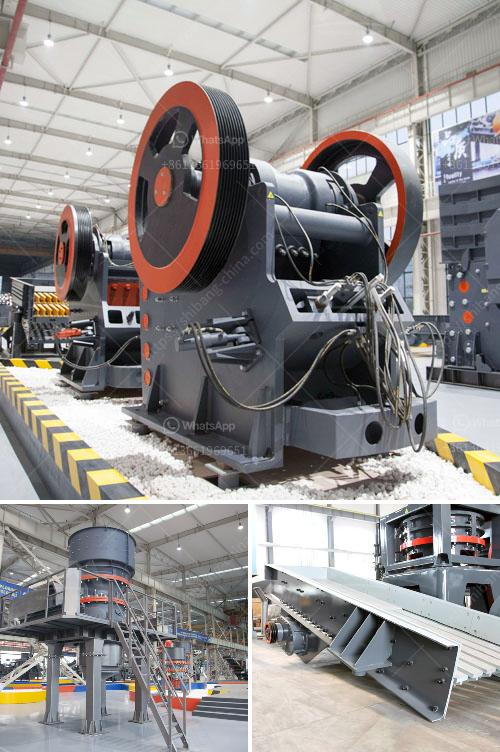

<h3>modeling of power mill ball</h3>
In the world of industrial processes, grinding is a crucial step that often determines the quality and efficiency of the final product. The ability to accurately model and simulate the behavior of a grinding mill ball is therefore of paramount importance. One widely used grinding mill is the power mill ball, commonly found in mining, cement, and other heavy-duty industries. In this article, we will explore the concept of modeling power mill balls and its significance in achieving efficient grinding operations.

Modeling power mill balls involves using advanced mathematical algorithms to describe the motion, impact, and behavior of the balls inside the mill. It takes into account factors such as ball size, shape, material properties, rotational speed, and the presence of other components in the mill. By accurately simulating the ball dynamics, it becomes possible to optimize the mill's operating conditions, leading to improved grinding performance.

One key advantage of modeling power mill balls is the ability to predict and prevent ball breakage. Excessive ball breakage can lead to reduced grinding efficiency and increased mill maintenance costs. By understanding the stress distribution on each ball and identifying critical regions prone to breakage, optimal operating conditions can be determined to minimize ball failure. This helps prolong the lifespan of the balls and ensures uninterrupted production.

Furthermore, modeling power mill balls allows for the optimization of ball size distribution within the mill. The size distribution of balls significantly affects the grinding process, as it determines the impact and shear forces experienced by the particles being ground. Using model-based simulations, engineers can experiment with different ball size distributions to find the most efficient combination, maximizing the throughput and minimizing energy consumption.

Another benefit of modeling power mill balls is the ability to optimize the liner design of the mill. Liners play a critical role in the grinding process by reducing wear on the mill shell and improving energy transfer efficiency. By accurately modeling the ball-liner interactions, it becomes possible to identify areas of high wear and design liners that can withstand the grinding forces for an extended period. This not only reduces maintenance downtime but also ensures consistent and reliable grinding performance.

In recent years, advancements in computational capabilities and simulation software have made modeling power mill balls more accessible and accurate. Modern simulation tools can incorporate complex physics and provide detailed insights into the grinding process, which were previously unattainable. This enables engineers to make informed decisions regarding the choice of mill, ball size, operating parameters, and liner design, ultimately improving the overall process efficiency.

In summary, modeling power mill balls is an essential tool for the efficient grinding of various materials. It allows engineers to predict ball breakage, optimize ball size distribution, and design effective mill liners. By harnessing the power of advanced simulation techniques, industries can achieve higher grinding efficiency, reduced maintenance costs, and improved product quality. As grinding operations continue to evolve, the use of modeling and simulation will play an increasingly crucial role in driving innovation and optimizing process performance.
<h3>Contact us</h3><ul><li><strong>Whatsapp:&nbsp;<a href="https://wa.me/8613661969651">+8613661969651</a></strong></li><li><a href="https://swt.shibang-china.com/?git&amp;zhl&amp;modeling of power mill ball"><strong>Online Service(chat now)</strong></a></li></ul><h3>Related</h3><ul><li><a href='purification process of iron ore.md'>purification process of iron ore</a></li><li><a href='concrete crushing machine cost.md'>concrete crushing machine cost</a></li><li><a href='ball mill ball mill factories.md'>ball mill ball mill factories</a></li><li><a href='rock crusher distributors in denver colorado.md'>rock crusher distributors in denver colorado</a></li><li><a href='ball mills for mining price.md'>ball mills for mining price</a></li></ul>