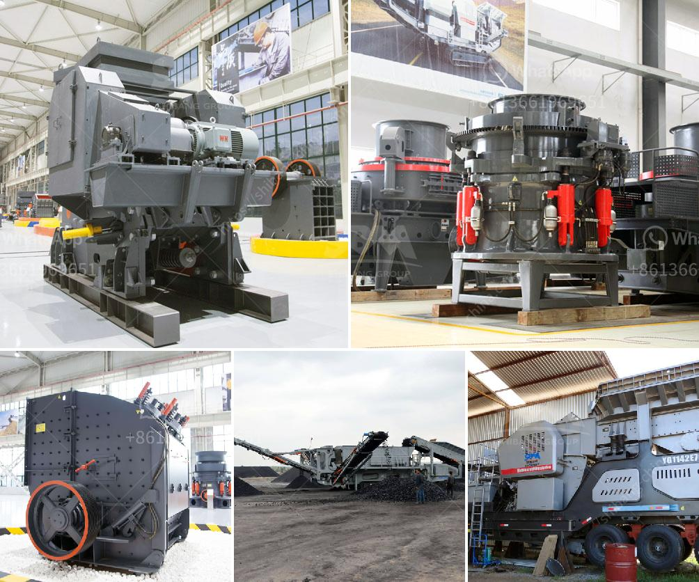

<h3>mtm 160 ball mill spare parts suppliers in india</h3>
MTM 160 mill is designed to meet the challenges of grinding materials like limestone, gypsum, coal, kaolin, etc. It has been widely used in industrial production in the fields of metallurgy, building materials, mining, chemical engineering, cement and other industries. With high efficiency and low energy consumption, this mill has become the preferred choice for many customers.

However, like any other machine, the MTM 160 mill may face the need for spare parts. In such cases, it becomes crucial to have reliable suppliers who can provide high-quality spare parts to ensure smooth operation and minimize downtime.

When it comes to finding spare parts suppliers for MTM 160 mill in India, there are several options to consider. These suppliers offer a wide range of spare parts that are specially designed to fit and function perfectly with the mill.

One of the key factors to consider when choosing a supplier is the quality of their spare parts. High-quality spare parts ensure the longevity and optimum performance of the mill. Reputable suppliers in India follow strict quality control measures to deliver reliable and durable spare parts.

Another important aspect is the availability of spare parts. The supplier should maintain a ready stock of commonly required spare parts to ensure quick delivery and minimal disruption to the production process.

Additionally, the supplier should have a strong customer support system. This includes timely responses to queries, efficient handling of complaints, and providing assistance with installation and maintenance procedures.

An ideal spare parts supplier for MTM 160 mill should also offer competitive pricing. They should provide cost-effective solutions without compromising on the quality of the parts.

In conclusion, finding the right spare parts supplier for your MTM 160 mill in India is crucial for uninterrupted and efficient operation. It is advisable to choose a supplier with a proven track record, offering high-quality spare parts, excellent customer support, and competitive pricing. By doing so, you can ensure the smooth functioning of your mill and maximize its productivity.
<h3>Contact us</h3><ul><li><strong>Whatsapp:&nbsp;<a href="https://wa.me/8613661969651">+8613661969651</a></strong></li><li><a href="https://swt.shibang-china.com/?git&amp;zhl&amp;mtm 160 ball mill spare parts suppliers in india"><strong>Online Service(chat now)</strong></a></li></ul><h3>Related</h3><ul><li><a href='stone quarrying equipment.md'>stone quarrying equipment</a></li><li><a href='1000 ton crusher.md'>1000 ton crusher</a></li><li><a href='stone crusher machine price in usa.md'>stone crusher machine price in usa</a></li><li><a href='ball mill ball mill factories.md'>ball mill ball mill factories</a></li><li><a href='mobile stone crusher for concrete.md'>mobile stone crusher for concrete</a></li></ul>