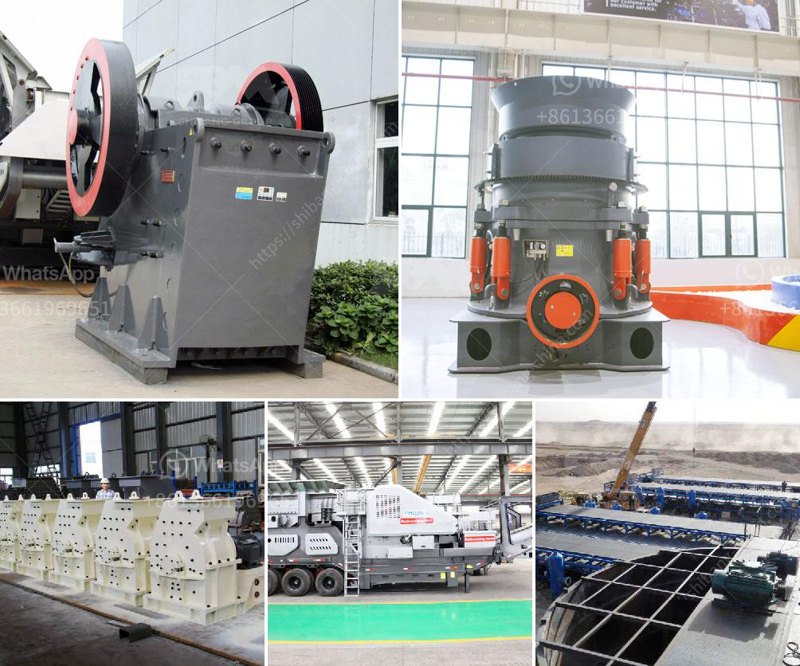

<h3>new generation of hammer mill</h3>
For centuries, the hammer mill has been an indispensable machine in many industries, used for crushing a variety of raw materials into smaller particles. While its predecessors have evolved over the years, new generation hammer mills are more advanced, powerful, and versatile than ever.

In the past, the hammer mill was primarily used for secondary crushing in cement plants and raw material grinding. However, recent technological advancements have enabled the addition of primary and even tertiary crushing functions, making the hammer mill more of a multipurpose machine that can process different materials, provide a wider range of particle sizes, and produce higher crushing efficiencies.

One of the key advancements in the new generation hammer mill is its ability to crush materials into finer particles. This is achieved through higher rotational speed, improved size reduction mechanisms, and advanced grinding technology. As a result, the new generation hammer mill delivers more consistent and uniform particle size distribution, enhancing the overall efficiency of downstream processing and reducing energy consumption.

The new generation hammer mill also offers enhanced safety features such as explosion-proof doors, emergency stop buttons, and comprehensive monitoring systems. These safety mechanisms ensure operator protection and minimize the risk of equipment damage, making the new generation hammer mill a reliable and safe solution for crushing operations.

Another notable feature of the new generation hammer mill is its reduced noise emissions. State-of-the-art components and innovative design techniques have significantly reduced the noise generated during operation, creating a more pleasant and comfortable working environment.

Moreover, the new generation hammer mill is equipped with advanced control systems that provide real-time monitoring, performance optimization, and remote access capabilities. This enables operators to easily adjust settings, monitor performance parameters, and troubleshoot issues, leading to improved operational efficiency, reduced downtime, and increased overall productivity.

The versatility of the new generation hammer mill is also worth mentioning. Its ability to handle a wide range of materials, including grains, wood, biomass, plastics, and pharmaceuticals, makes it a valuable asset in numerous industries. The new generation hammer mill can be customized to meet specific requirements, offer specific feeding and discharge options, and even integrate with other process equipment, further expanding its applications and versatility.

In conclusion, the new generation hammer mill represents a significant advancement in the crushing industry. Its improved size reduction capabilities, enhanced safety features, reduced noise emissions, and advanced control systems make it a game-changer in the field. Whether it is used for primary, secondary, or tertiary crushing, the new generation hammer mill delivers high performance, efficiency, and versatility, revolutionizing crushing operations across various industries.
<h3>Contact us</h3><ul><li><strong>Whatsapp:&nbsp;<a href="https://wa.me/8613661969651">+8613661969651</a></strong></li><li><a href="https://swt.shibang-china.com/?git&amp;zhl&amp;new generation of hammer mill"><strong>Online Service(chat now)</strong></a></li></ul><h3>Related</h3><ul><li><a href='products scm ultrafine mill.md'>products scm ultrafine mill</a></li><li><a href='silica sand price per ton.md'>silica sand price per ton</a></li><li><a href='barite ore processing in morocco.md'>barite ore processing in morocco</a></li><li><a href='price list of cone crushers made in china.md'>price list of cone crushers made in china</a></li><li><a href='cement industries ball coal mill.md'>cement industries ball coal mill</a></li></ul>