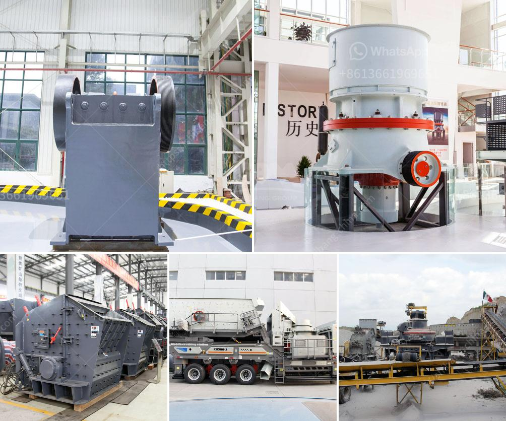

<h3>new hammer mill pricing</h3>
A hammer mill is an essential machine in the pharmaceutical, food processing, and chemical industries. It is used to shred or crush materials into smaller pieces, making it easier to process and transport. Over the years, advancements in technology have improved the efficiency, durability, and overall performance of hammer mills. Consequently, the pricing of new hammer mills has witnessed a significant shift.

When looking at the pricing of new hammer mills, various factors come into play. These factors include the manufacturing cost, demand and supply dynamics, technological innovations, and competition among manufacturers.

Manufacturing a hammer mill involves multiple components and intricate processes. The cost of raw materials such as steel, bearings, motors, and other components directly impact the overall pricing. Additionally, labor costs, overheads, and profit margins contribute to the final price of the machine.

One of the driving forces behind the pricing of new hammer mills is technological advancements. Manufacturers have continuously invested in research and development, leading to the introduction of more innovative and efficient models. These advancements contribute to increased productivity, reduced maintenance, and improved energy efficiency. However, these improvements in technology often come at a higher cost, which is reflected in the pricing of the new hammer mills.

The hammer mill market is highly competitive, with numerous manufacturers vying for market share. In an effort to attract customers, manufacturers continuously strive to offer competitive pricing by streamlining production processes and minimizing costs. This intense competition often leads to price fluctuations, with manufacturers adjusting their prices to gain a competitive edge.

The demand for hammer mills can fluctuate based on various factors such as economic conditions, changes in industry regulations, and technological advancements. When demand is high, manufacturers may increase their prices due to limited supply. On the other hand, during periods of low demand, manufacturers may adjust their prices to attract customers.

Customers in different industries have unique requirements when it comes to hammer mills. Some may require additional features or customization to meet their specific needs. Customization increases manufacturing costs, which are then reflected in the pricing. Manufacturers often offer different models and variations to accommodate various customer demands, ranging from basic models to highly advanced and specialized machines.

In conclusion, the pricing of new hammer mills is influenced by various factors, including manufacturing costs, technological advancements, competition among manufacturers, demand and supply dynamics, and customer expectations. As technology continues to advance, manufacturers are investing in research and development to improve the efficiency, durability, and overall performance of hammer mills. While these advancements come at an increased cost, they also offer enhanced benefits to users. Additionally, the competitive market dynamics encourage manufacturers to optimize production processes and minimize costs to offer competitive pricing.
<h3>Contact us</h3><ul><li><strong>Whatsapp:&nbsp;<a href="https://wa.me/8613661969651">+8613661969651</a></strong></li><li><a href="https://swt.shibang-china.com/?git&amp;zhl&amp;new hammer mill pricing"><strong>Online Service(chat now)</strong></a></li></ul><h3>Related</h3><ul><li><a href='jaw crusher pe.md'>jaw crusher pe</a></li><li><a href='quarry crusher in nigeria.md'>quarry crusher in nigeria</a></li><li><a href='vertical roller mill for cement grinding.md'>vertical roller mill for cement grinding</a></li><li><a href='stone crusher plant design pdf.md'>stone crusher plant design pdf</a></li><li><a href='stone crushers for sale in kenya.md'>stone crushers for sale in kenya</a></li></ul>