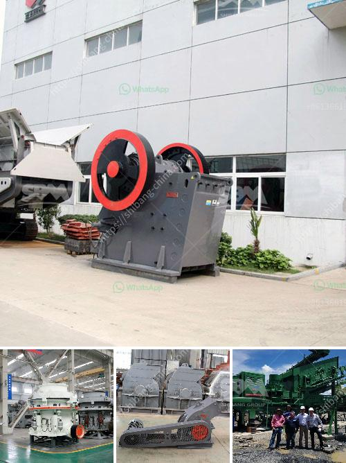

<h3>new technology ball mill factories europe</h3>
Europe has always been at the forefront of technological advancements, and the ball mill industry is no exception. With the introduction of new technology, European ball mill factories are paving the way for efficient grinding and processing of materials. These modern factories are increasingly embracing innovative techniques that improve productivity, reduce costs, and promote sustainability. In this article, we will explore some of the latest technologies being utilized in ball mill factories across Europe.

Automation and robotics are revolutionizing the way ball mill factories operate. European manufacturers have implemented robotics in manufacturing processes to increase efficiency and reduce manual labor. Advanced robotics systems can perform repetitive tasks with precision, ensuring consistent output and quality. These systems also minimize the risk of accidents, resulting in a safer work environment for employees.

The integration of advanced control systems has significantly improved operational efficiency in European ball mill factories. Real-time monitoring and control systems allow operators to optimize grinding operations by adjusting parameters such as speed, feed rate, and mill filling. These systems ensure optimal energy utilization, reducing power consumption and maximizing throughput. By constantly monitoring key performance indicators, European factories can identify potential issues before they escalate, preventing costly downtimes.

European ball mill factories are actively focusing on energy-efficient practices to mitigate their environmental impact. By adopting energy-saving technologies, factories can reduce their carbon footprint and contribute to sustainability goals. For instance, some companies utilize high-efficiency motors and drive systems, reducing energy consumption during the grinding process. Additionally, heat recovery systems are often employed to capture waste heat, which can then be reused for other purposes, such as heating or power generation.

European ball mill factories are constantly experimenting with new materials and coatings to optimize the grinding process. Advances in materials science have led to the development of durable and wear-resistant liners, increasing mill lifespan and reducing maintenance requirements. Additionally, innovative coatings are being applied to grinding media to reduce wear and increase grinding efficiency. These advancements result in higher productivity, reduced downtime, and lower operating costs.

European ball mill factories are increasingly leveraging data analytics and artificial intelligence (AI) to improve production processes. By collecting and analyzing large volumes of data, factories can identify patterns, anticipate potential issues, and make informed decisions. AI algorithms can optimize grinding circuits, enabling factories to achieve the desired particle size distributions and improving overall product quality. Additionally, predictive maintenance algorithms can detect equipment failures before they occur, reducing unplanned downtime.

European ball mill factories are embracing new technologies to enhance their competitiveness and sustainability. Automation, advanced control systems, energy efficiency measures, cutting-edge materials, and data analytics are revolutionizing the way these factories operate. By harnessing the power of these technologies, European factories are poised to achieve higher productivity, reduce costs, and contribute to a greener future for the industry as a whole.
<h3>Contact us</h3><ul><li><strong>Whatsapp:&nbsp;<a href="https://wa.me/8613661969651">+8613661969651</a></strong></li><li><a href="https://swt.shibang-china.com/?git&amp;zhl&amp;new technology ball mill factories europe"><strong>Online Service(chat now)</strong></a></li></ul><h3>Related</h3><ul><li><a href='company mobile crushers.md'>company mobile crushers</a></li><li><a href='capacity 70 130tph impact crusher.md'>capacity 70 130tph impact crusher</a></li><li><a href='50tpd mini cement plant cost in india.md'>50tpd mini cement plant cost in india</a></li><li><a href='hammer mills for stone.md'>hammer mills for stone</a></li><li><a href='rock crusher machine cost.md'>rock crusher machine cost</a></li></ul>