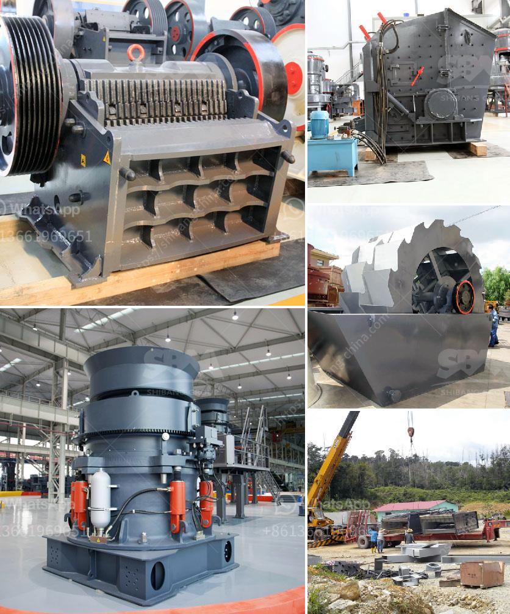

<h3>new technology stone crusher in india</h3>
Stone crushing industry is an important industrial sector in the country engaged in producing crushed stone of various sizes depending upon the requirement which acts as raw material for various construction activities such as construction of roads, highways, bridges, buildings, canals etc. It is estimated that there are over 12,000 stone crusher units in India.

The number is expected to grow further keeping in view the future plans for development of infrastructure of roads, canals, and buildings that are required for overall development of the country. In India, the Stone Crushing Industry sector is estimated to have an annual turnover of Rs. 5000 crore (equivalent to over US$ 1 billion) and is therefore an economically important sector.

The sector is estimated to be providing direct employment to over 500,000 people engaged in various activities such as mining, crushing plant, transportation of mined stones and crushed products etc. Most of these personnel are from rural and economically backward areas where employment opportunities are limited and therefore it carries greater significance in terms of social importance in rural areas. It is a source of earning for uneducated poor unskilled rural people.

Over the years, the stone crushing industry has been incorporating new technology to meet the increasing demands of its customers. The stone crusher is one such industry that exists in the vicinity of almost all major cities/towns throughout the country in all the states because the construction activities go on throughout the country.

As transportation of stone over long distances adds to cost of the crushed stone products, the crushers need to be necessarily located nearer to the demand centers such as cities, bridges, highways, canals, etc.

It is advantageous if the crushed stone unit is set up near the quarries where the granite boulders of various sizes are available for the crushing unit. The wastage from the granite industry will be of much use to the crushed stone unit.

Stone crushing units are not stand alone crushing units, but stone mining is also associated with this activity; in fact stone mining is the primary and basic activity for the stone crushing units. Therefore this kind of industrial units need scrutiny while granting permission for environmental and mining operations, especially at the time of NOC (i.e. Consent to Establishment) stage.

It is therefore recommended that stone crusher units be allowed to function on the site they were set up initially. In such a case, the units should preferably be near to urban areas or major construction projects.

However, in the absence of any centralized National or State Level environmental management agency, the control of emission is approached at local or regional level through the Department of Mines and Geology. Therefore, it is recommended that stone crusher owners and entrepreneurs like cement factories and steel plants should only be allowed to set up in 'No Development Zones' (NDZ), which are at least 8 km away from the nearest town, or environmental sensitive areas such as schools, hospitals, or religious places etc.

In conclusion, the stone crushing industry in India is growing at a rapid pace and therefore, it demands the use of modern technology for its efficient functioning and reliability. In order to set up a stone crushing plant, the minimum capital required is Rs 5 crore and the investors are expected to invest in local companies and banks. It will also create employment opportunities for hundreds of thousands of people who will be directly and indirectly associated with this industry and contribute to the overall development of the country.
<h3>Contact us</h3><ul><li><strong>Whatsapp:&nbsp;<a href="https://wa.me/8613661969651">+8613661969651</a></strong></li><li><a href="https://swt.shibang-china.com/?git&amp;zhl&amp;new technology stone crusher in india"><strong>Online Service(chat now)</strong></a></li></ul><h3>Related</h3><ul><li><a href='conveyor belts in peru.md'>conveyor belts in peru</a></li><li><a href='stone crusher zone in nepal.md'>stone crusher zone in nepal</a></li><li><a href='carbon black processing plant.md'>carbon black processing plant</a></li><li><a href='buy stone crusher in south africa.md'>buy stone crusher in south africa</a></li><li><a href='used crusher plants on sale in uae.md'>used crusher plants on sale in uae</a></li></ul>