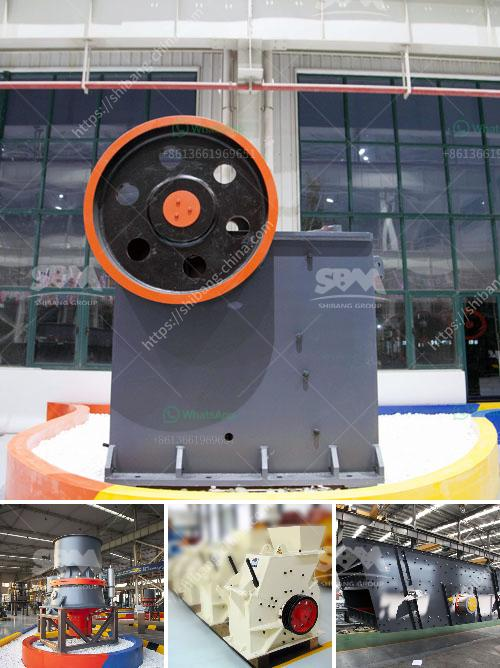

<h3>nigeria stone crusher to buy</h3>
Nigeria is a country blessed with abundant natural resources. It has numerous mineral deposits, and one of them is limestone – a crucial input in the cement manufacturing industry. The extraction and crushing of rocks into fine particles are essential for the construction of roads, buildings, and bridges. Nigeria boasts diverse stone crusher machines that are very effective and efficient. Unfortunately, some of the stone crushers' manufacturers neglect the importance of servicing and spare parts to their customers.

Stone crushers are durable machines that are built to last. However, regular servicing is essential to ensure that they continue to operate optimally. Frequent servicing allows the identification and rectification of minor faults, preventing them from developing into major problems. It involves checking and replacing worn-out components, lubricating moving parts, and conducting comprehensive inspections.

1. Manufacturer Reputation: Select a manufacturer with a good reputation for producing high-quality stone crusher machines. Research customer reviews and testimonials to gauge their credibility and performance.

2. After-sales Service: Adequate after-sales service is crucial when buying a stone crusher machine. This includes prompt response to queries, providing technical assistance, and ensuring the availability of spare parts.

A stone crusher machine aims to reduce large rocks into smaller pieces. The crushed stone can be used for various purposes, such as for making concrete, road construction, manufacture of cement, and other uses. It is important to consider the desired output size, shape, and crushing capacity when selecting a stone crusher machine. Some factors that contribute to high crushing efficiency include:

1. Crushing Chamber Design: The design of the crushing chamber affects the crushing efficiency. A deep crushing chamber ensures more significant material compression and reduces the chances of material being stuck.

2. Motor Power: The power of the stone crusher machine's motor affects its crushing capacity. Ensure that the motor has adequate power to crush the desired quantity of rocks into the desired size.

3. Crushing Speed: The speed at which the crusher rotates affects the crushing efficiency. Higher crushing speeds tend to result in finer crushed particles.

In conclusion, stone crushers are crucial equipment in the construction industry. Nigeria is blessed with abundant limestone deposits, which makes it essential to have efficient stone crushers. When buying a stone crusher, it is necessary to consider factors such as the manufacturer's reputation, after-sales service, and the crusher's crushing efficiency. Additionally, regular servicing is important to ensure the optimal performance and prolonged lifespan of stone crushers. By following these guidelines, buyers can make informed decisions and select stone crushers that meet their specific requirements.
<h3>Contact us</h3><ul><li><strong>Whatsapp:&nbsp;<a href="https://wa.me/8613661969651">+8613661969651</a></strong></li><li><a href="https://swt.shibang-china.com/?git&amp;zhl&amp;nigeria stone crusher to buy"><strong>Online Service(chat now)</strong></a></li></ul><h3>Related</h3><ul><li><a href='ball mill in mining.md'>ball mill in mining</a></li><li><a href='basalt crushing machinery processing line.md'>basalt crushing machinery processing line</a></li><li><a href='crusher price in nepal.md'>crusher price in nepal</a></li><li><a href='vibrating screen efficiency.md'>vibrating screen efficiency</a></li><li><a href='used philippines jaw crushers.md'>used philippines jaw crushers</a></li></ul>