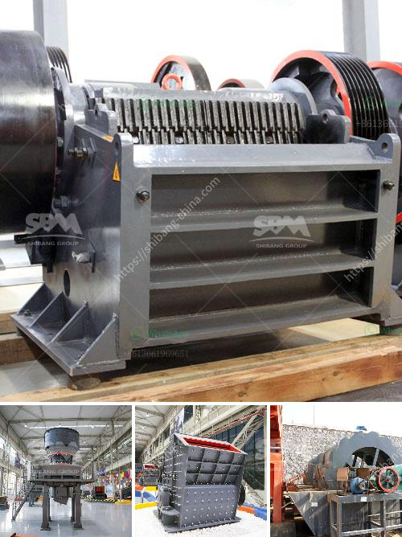

<h3>old cement plant in india for sale</h3>
The ever-evolving world of construction demands the availability of quality cement in large quantities. India, being the second-largest producer of cement globally, constantly seeks ways to meet this growing demand. In recent times, there has been a surge in the sale of old cement plants in India, presenting a golden opportunity for investors looking to tap into this thriving industry.

One such old cement plant, situated in India, holds immense historical significance. Cement production at this plant dates back several decades when it was a thriving center for industry and employment. Having played a vital role in the nation's development, this plant stands as a testament to India's industrial prowess.

Apart from its historical value, the strategic location of this cement plant adds to its appeal. Situated in close proximity to key transportation networks like highways and railways, it offers convenient access to both raw materials and target markets. Additionally, the plant's vicinity to urban centers provides a diverse pool of skilled labor and potential customers.

While it may be an old plant, its foundations offer solid infrastructure and a well-established setup. This creates an ideal opportunity for interested investors to modernize and revitalize the facility, leveraging the advantages of an existing production unit. Incorporating state-of-the-art technology, optimizing production processes, and enhancing energy efficiency can position this facility as a high-yielding cement manufacturing hub.

The Indian cement market showcases exponential growth potential driven by increased government spending on infrastructure development and the rising demand for residential and commercial construction projects. By acquiring and upgrading an old cement plant, investors can tap into this booming market, ensuring a steady supply of cement while contributing to the nation's economic growth.

Efforts to reduce CO2 emissions and minimize the ecological footprint of cement production have become paramount. Acquiring an old plant allows investors to adopt eco-friendly practices, ensuring compliance with modern environmental regulations. Implementing recycling methods, incorporating alternative fuels, and improving energy efficiency can transform the plant into a sustainable and responsible cement production facility.

As the demand for cement continues to soar in India, the availability of an old cement plant for sale highlights a promising investment opportunity. Its historical significance, strategic location, and potential for modernization make it an attractive proposition for investors looking to capitalize on the thriving Indian cement market. By revamping and upgrading this facility, India can witness the rejuvenation of a once-thriving cement production hub, contributing to the nation's growth while embracing sustainable practices.
<h3>Contact us</h3><ul><li><strong>Whatsapp:&nbsp;<a href="https://wa.me/8613661969651">+8613661969651</a></strong></li><li><a href="https://swt.shibang-china.com/?git&amp;zhl&amp;old cement plant in india for sale"><strong>Online Service(chat now)</strong></a></li></ul><h3>Related</h3><ul><li><a href='consultants to help to start a stone crusher.md'>consultants to help to start a stone crusher</a></li><li><a href='cost of jaw crusher.md'>cost of jaw crusher</a></li><li><a href='jaw crusher for sale in philippines.md'>jaw crusher for sale in philippines</a></li><li><a href='quick lime powder machine.md'>quick lime powder machine</a></li><li><a href='price for jaw crusher.md'>price for jaw crusher</a></li></ul>