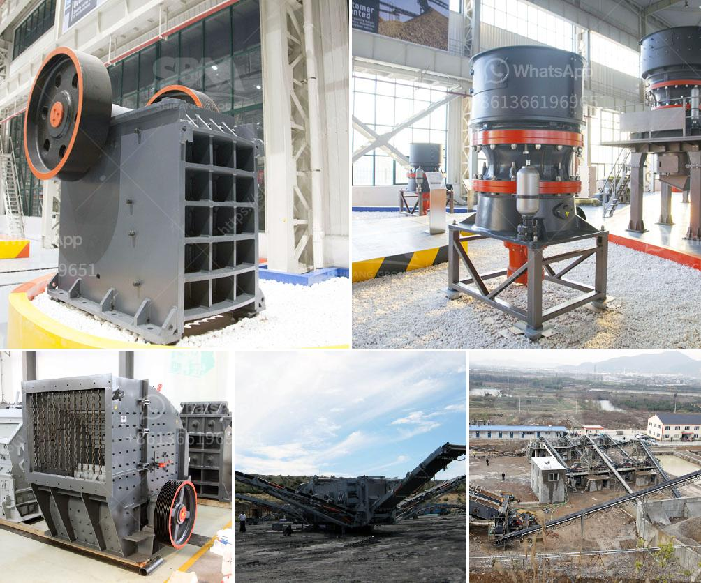

<h3>old used coal washing plants</h3>
Coal, for many years, served as a primary source of energy globally. While its usage has seen a decline in recent years due to environmental concerns, the remnants of its legacy continue to exist in the form of old, used coal washing plants. A coal washing plant is an essential facility that separates impurities from coal, ensuring a cleaner, more efficient energy source. In this article, we explore the potential of repurposing old coal washing plants and their significance in a modern, sustainable world.

Coal washing plants, once pivotal to the coal mining industry, have often been abandoned or considered obsolete due to the shift toward renewable and cleaner energy sources. These plants, with their large footprints and intricate infrastructure, represent an untapped resource that holds potential for various purposes.

One of the most significant ways to repurpose old coal washing plants is to convert them into facilities for environmental rehabilitation and ecological preservation. The large open spaces can be transformed into botanical gardens, nature reserves, or centers for education on sustainable practices. These adaptations allow former coal mining spaces to contribute positively to their surrounding ecosystems, fostering biodiversity and environmental awareness.

The advanced infrastructure of abandoned coal washing plants presents an opportunity for industrial upcycling. With necessary modifications and modernization, these plants could be transformed into processing facilities for alternate energy sources, such as biomass or biofuel production. This approach would utilize existing structures, minimizing the carbon footprint associated with constructing new plants.

Coal washing plants were originally constructed to separate coal from impurities, including water. Given their expertise in water management, these plants could be repurposed into water treatment facilities. With increasing concerns over water scarcity and pollution, retrofitting old plants to treat wastewater or perform desalinization processes would enhance regional water security and sustainability.

Many old coal washing plants are situated in regions heavily dependent on the coal mining industry. Repurposing these plants can help revitalize local economies and provide new job opportunities. By transforming these areas into industrial complexes for alternative energy or manufacturing, the communities can experience a productive transition while preserving their industrial heritage.

Coal washing plants often feature unique architectural and engineering designs, acting as reminders of a significant era in energy production. Efforts could be made to restore and preserve these structures as historical landmarks. Such restoration projects blend aesthetics and history, attracting tourists, stimulating local economies, and promoting a shared understanding of energy evolution.

In an era where sustainability is increasingly valued, the repurposing of old coal washing plants provides a valuable opportunity to re-envision the use of these infrastructure relics. Whether it comes in the form of environmental rehabilitation, industrial upgrades, wastewater treatment facilities, economic revitalization, or historical preservation, these adaptations represent a win-win solution for the energy sector and society as a whole. As we navigate the transition towards cleaner energy, let us not forget the potential that lies within these forgotten structures – a potential that can lead us to a more sustainable future.
<h3>Contact us</h3><ul><li><strong>Whatsapp:&nbsp;<a href="https://wa.me/8613661969651">+8613661969651</a></strong></li><li><a href="https://swt.shibang-china.com/?git&amp;zhl&amp;old used coal washing plants"><strong>Online Service(chat now)</strong></a></li></ul><h3>Related</h3><ul><li><a href='portable crusher rental in las vegas.md'>portable crusher rental in las vegas</a></li><li><a href='to buy a second hand mobile stone crusher plant india.md'>to buy a second hand mobile stone crusher plant india</a></li><li><a href='industrial rock crusher.md'>industrial rock crusher</a></li><li><a href='earthen clay products manufacturing process.md'>earthen clay products manufacturing process</a></li><li><a href='turkey gold processing plants.md'>turkey gold processing plants</a></li></ul>