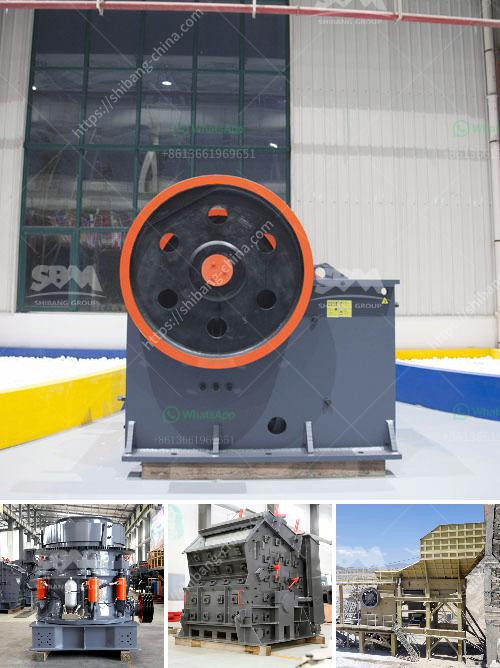

<h3>open pit mobile crushing plant</h3>
Open pit mobile crushing plant, also known as mobile crusher, is a common type of mining equipment in open pit mines. This type of crushing plant is popular in mid-summer when the crushing temperature is high, and extremely hot weather conditions become a challenge for many crushing plants. With its compact and flexible design, open pit mobile crushing plant can efficiently move to any location at the mining site, greatly reducing transportation costs and saving time.

The open pit mobile crushing plant is equipped with a low-hopper design to accommodate the haul truck capacity and increase efficiency during loading and unloading. The crushing plant is designed to crush the ore in one shift (8-10 hours) – an operation with a capacity of 300-400 tons per hour. Additionally, the crushing plant is capable of crushing up to 500-650 tons of rock per hour. This is further supplemented by its efficient loading capability, which will speed up the production process.

The open pit mobile crushing plant can be equipped with jaw crusher, impact crusher and cone crusher as the primary crushing equipment. It can process raw materials with high moisture content and eliminate the common problems associated with crushing high moisture content materials. The crushing plant is equipped with a water spraying system to reduce dust generation during crushing operations, ensuring a clean and environmentally friendly working atmosphere.

In conclusion, open pit mobile crushing plant is an ideal choice for quarries or construction sites where short-term production capacity is required to be medium to large. Open pit mobile crushing plant is the leading type of crushing equipment widely used in the industries of mining, metallurgy, and energy. The open pit mobile crushing plant can solve this problem effectively, reducing the cost of transportation and improving the flexibility of the equipment. With the continuous development of technology, the open pit mobile crushing plant is widely used in various application fields such as construction waste recycling, mining, and cement production.
<h3>Contact us</h3><ul><li><strong>Whatsapp:&nbsp;<a href="https://wa.me/8613661969651">+8613661969651</a></strong></li><li><a href="https://swt.shibang-china.com/?git&amp;zhl&amp;open pit mobile crushing plant"><strong>Online Service(chat now)</strong></a></li></ul><h3>Related</h3><ul><li><a href='price of stone crushers in malaysia.md'>price of stone crushers in malaysia</a></li><li><a href='mobile stone crusher machine europa.md'>mobile stone crusher machine europa</a></li><li><a href='jaw crusher suppliers south africa.md'>jaw crusher suppliers south africa</a></li><li><a href='cone crusher deos in mexico.md'>cone crusher deos in mexico</a></li><li><a href='mobile crusher in japan used crusher.md'>mobile crusher in japan used crusher</a></li></ul>