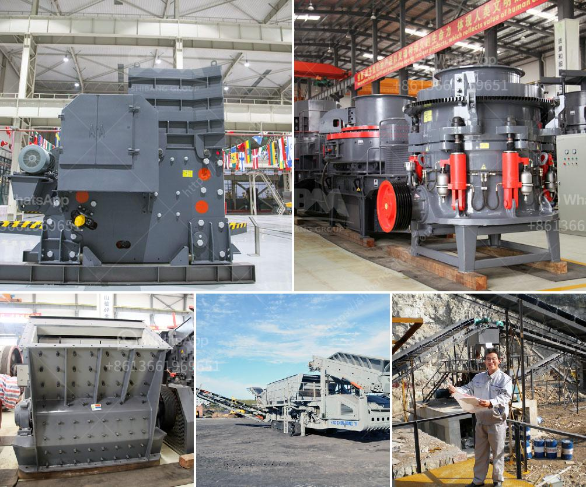

<h3>operation and operation of a jaw crusher</h3>
A jaw crusher is designed to act as a primary crusher for a variety of materials. It is an essential machine in a wide range of fields such as mining, quarrying, and construction industries. Jaw crushers are used to crush larger rocks into smaller pieces in order to efficiently handle the subsequent crushing stages.

The operation of a jaw crusher is simple and straightforward. The jaw crusher uses motor drives to control the belt and pulley movement, which in turn moves the jaw plate in order to achieve the desired crushing effect. The materials are crushed between the two jaws, which are called as the stationary jaw and the movable jaw.

The stationary jaw is fixed while the movable jaw is attached to a flywheel. The flywheel is responsible for generating an inertia force that creates an oscillating motion of the jaw towards the fixed jaw. This motion helps to crush the materials.

The operation of a jaw crusher involves feeding the materials into the machine through the vibrating feeder. The rocks are then crushed in the crushing chamber, which consists of a fixed jaw plate and a movable jaw plate. The crushed materials are discharged through the discharge opening at the bottom of the crusher.

A jaw crusher is typically used to crush hard and abrasive materials, including granite, quartz, and basalt. It can be used in various applications such as mining, construction, and recycling.

To ensure the efficient operation of a jaw crusher, regular inspections and maintenance are crucial. The jaw crusher should be inspected regularly for wear and tear, and any damaged or worn parts should be replaced promptly. Lubrication of the bearings is also necessary to prevent excessive friction and heat generation.

In conclusion, a jaw crusher plays a vital role in various industries by efficiently crushing large rocks into smaller pieces. Its simple operation and maintenance make it a popular choice for many applications. Regular inspections and maintenance are essential to ensure its longevity and optimal performance.
<h3>Contact us</h3><ul><li><strong>Whatsapp:&nbsp;<a href="https://wa.me/8613661969651">+8613661969651</a></strong></li><li><a href="https://swt.shibang-china.com/?git&amp;zhl&amp;operation and operation of a jaw crusher"><strong>Online Service(chat now)</strong></a></li></ul><h3>Related</h3><ul><li><a href='how to calculate grinding media in cement mill.md'>how to calculate grinding media in cement mill</a></li><li><a href='cement plants in west bengal list.md'>cement plants in west bengal list</a></li><li><a href='roller mill sahibabad.md'>roller mill sahibabad</a></li><li><a href='arriendo de chancadores chile.md'>arriendo de chancadores chile</a></li><li><a href='sri lankan building sand price.md'>sri lankan building sand price</a></li></ul>