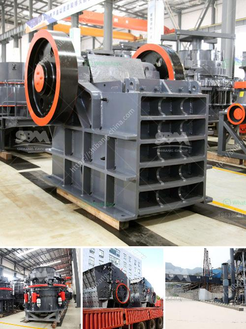

<h3>ore grinding grinding mill china</h3>
Ore grinding is a crucial step in the mining process that greatly impacts the efficiency and cost of extracting valuable minerals from the earth. China, known for its vast mineral resources, has become a global leader in ore grinding technology and equipment.

China's grinding mill industry has experienced rapid development in recent years, driven by the country's increasing demand for ore extraction. Grinding mills are used to crush and grind various materials, including rocks, ores, and minerals, into smaller pieces. The purpose of grinding is to increase the surface area of the material, making it easier to extract valuable minerals and reduce the size of particles for further processing.

China's ore grinding mills are designed and manufactured with advanced technology and high-quality materials to ensure efficient and reliable performance. These mills are equipped with grinding media, such as steel balls or rods, which are charged into the mill and collide with the ore to reduce its size. The grinding process can be dry or wet, depending on the type of mill and the desired end product.

China's grinding mill industry offers a wide range of options to suit different ore types and processing requirements. Ball mills, vertical mills, and autogenous mills are among the most commonly used types of grinding mills in China. Each type has its advantages and disadvantages, depending on factors such as the hardness of the ore, the required grinding fineness, and the size of the mill.

In recent years, China has also made significant progress in developing environmentally friendly grinding mills. These mills are designed to minimize energy consumption and reduce the environmental impact of ore grinding. China's commitment to sustainable development has driven the industry to invest in technologies and practices that improve energy efficiency and reduce emissions.

The growing demand for ore grinding equipment in China has also led to increased competition among manufacturers. Companies are continuously investing in research and development to improve the performance and efficiency of their grinding mills. This competition benefits the mining industry by driving innovation and providing cost-effective solutions for ore processing.

In conclusion, China's ore grinding mill industry plays a vital role in the efficient extraction of valuable minerals. The country's technological advancements and commitment to sustainability have positioned it as a global leader in this field. With ongoing research and development, China will continue to provide cutting-edge grinding mill solutions for the mining industry.
<h3>Contact us</h3><ul><li><strong>Whatsapp:&nbsp;<a href="https://wa.me/8613661969651">+8613661969651</a></strong></li><li><a href="https://swt.shibang-china.com/?git&amp;zhl&amp;ore grinding grinding mill china"><strong>Online Service(chat now)</strong></a></li></ul><h3>Related</h3><ul><li><a href='raymond mill and classifier.md'>raymond mill and classifier</a></li><li><a href='stone crusher machine or rock breakers.md'>stone crusher machine or rock breakers</a></li><li><a href='portable vibrating screen plant.md'>portable vibrating screen plant</a></li><li><a href='rock crushers cost tons per hour.md'>rock crushers cost tons per hour</a></li><li><a href='vertical mill for calcite.md'>vertical mill for calcite</a></li></ul>