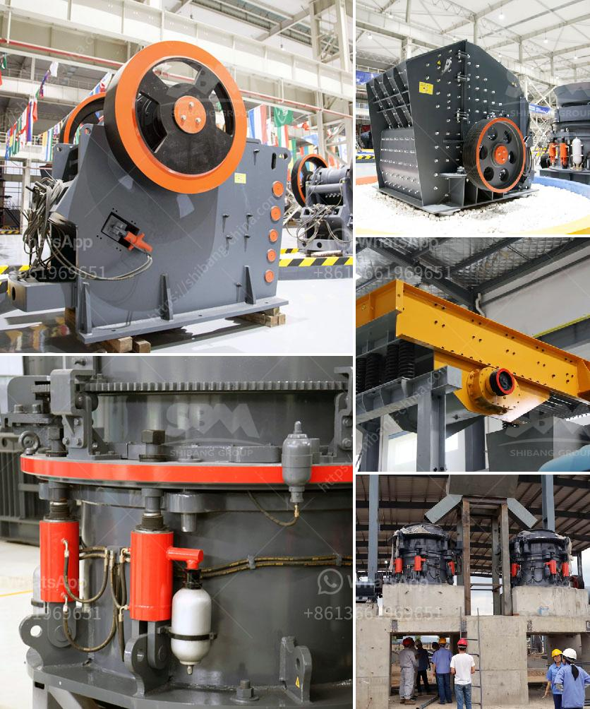

<h3>ouedkniss station concassage</h3>
In the fast-paced world of construction, the need for efficient and reliable equipment is paramount. This is where Ouedkniss Station Concassage comes into play. With its impressive range of crushing and screening plants, this innovative company has revolutionized the construction industry. Let's delve deeper into the world of Ouedkniss Station Concassage and explore how it has transformed the way projects are completed.

Ouedkniss Station Concassage prides itself on being a pioneer in the field of crushing and screening plants. With a commitment to delivering high-quality machinery, the company has built a reputation for excellence amongst its customers. Their range of plants includes both fixed and mobile options, catering to diverse construction needs.

One of the most notable aspects of the Ouedkniss Station Concassage range is its versatility. The plants are designed to handle various types of materials, ranging from hard rocks to softer aggregates. This adaptability ensures that the plants can be used across different construction projects, reducing the need for multiple machinery investments.

Furthermore, Ouedkniss Station Concassage places a strong emphasis on efficiency. Their plants are equipped with advanced technology and features, which optimize the crushing and screening process. This not only improves productivity but also reduces energy consumption and lowers operating costs. Construction companies utilizing these plants can therefore expect significant time and financial savings on their projects.

Another key advantage of Ouedkniss Station Concassage plants is their superior quality and durability. The company utilizes high-grade materials in the construction of its machinery, ensuring longevity and reliability even in the harshest working conditions. This reliability minimizes downtime, thus maximizing construction efficiency and allowing projects to stay on schedule.

Moreover, Ouedkniss Station Concassage goes beyond simply supplying machinery. The company provides comprehensive after-sales support, including regular maintenance and technical assistance. This commitment to customer satisfaction ensures smooth and uninterrupted operations throughout the lifespan of the equipment.

Ouedkniss Station Concassage is also committed to environmental sustainability. The company utilizes eco-friendly technology in its plants, ensuring minimal impact on the environment. This includes features such as dust suppression systems, noise reduction measures, and efficient water management systems. Construction companies using these plants can be assured that they are contributing to sustainable development principles.

Thanks to Ouedkniss Station Concassage, construction projects no longer have to rely on outdated and inefficient machinery. This company's range of crushing and screening plants has transformed the industry by providing efficient, versatile, and reliable solutions. From enhanced productivity to reduced costs and a focus on sustainability, Ouedkniss Station Concassage is setting new standards in the construction sector.

In conclusion, Ouedkniss Station Concassage is revolutionizing the construction industry with its range of innovative crushing and screening plants. The company's commitment to efficiency, durability, and sustainability has made it a go-to supplier for construction companies worldwide. As the demand for high-quality machinery continues to grow, Ouedkniss Station Concassage is poised to lead the way in shaping the future of construction.
<h3>Contact us</h3><ul><li><strong>Whatsapp:&nbsp;<a href="https://wa.me/8613661969651">+8613661969651</a></strong></li><li><a href="https://swt.shibang-china.com/?git&amp;zhl&amp;ouedkniss station concassage"><strong>Online Service(chat now)</strong></a></li></ul><h3>Related</h3><ul><li><a href='calcium carbonate plants in qatar.md'>calcium carbonate plants in qatar</a></li><li><a href='diagram of coal conveyor tunnel.md'>diagram of coal conveyor tunnel</a></li><li><a href='stone sand making process pdf.md'>stone sand making process pdf</a></li><li><a href='technology of conveyor belts.md'>technology of conveyor belts</a></li><li><a href='alluvial gold washing machine manufacturer.md'>alluvial gold washing machine manufacturer</a></li></ul>