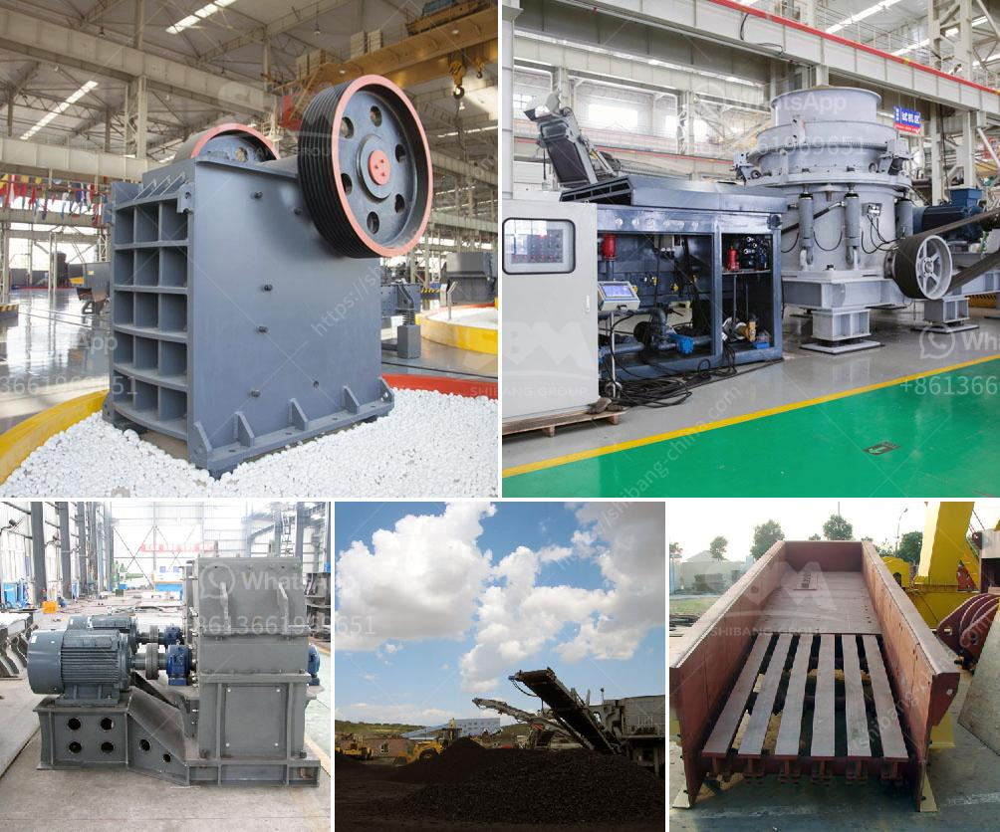

<h3>output size of stone crusher machine</h3>
The stone crusher machine is a machine used to convert the stone from large size to large particles. Depending on the required output size, various models are available for download. They are used in industries such as mining, construction, metallurgy, engineering, and highway construction. The output size of the crusher machine will determine the yield of the production line.

The stone crusher machine is widely used in mining, metallurgy, construction, chemical industry, and other industries. It can be used for primary, secondary, and fine crushing of more than 200 kinds of stone materials such as pebble, granite, basalt, iron ore, limestone, quartz, diabase, iron ore, gold, copper, etc. The crushed materials are widely used in construction aggregate and sand making.

The output size of the stone crusher machine determines the processing capacity of the whole production line. Therefore, it is crucial to choose a suitable model of stone crusher machine based on the desired output size.

Generally, the higher the output size requirements, the larger the size selection range of the stone crusher machine. For example, if the required finished product size is 30mm, the model that meets this requirement is YG938E69 mobile jaw crusher, which has feeding size of 500mm and output size range of 50-150mm. Another example is that if the required finished product size is 5mm, the model that meets this requirement is PCX800*600 crusher, which has feeding size of ≤50mm and output size range of 3-5mm.

In addition, the hardness, viscosity, humidity, and composition of the stone materials also affect the output size of the crusher machine. Different stones have different characteristics. For example, some stones are easy to break, while others are difficult to break. Therefore, it is important to choose a stone crusher machine with a suitable crushing chamber and a set of interchangeable fixed and movable plates according to the properties of the stone materials.

To summarize, the output size of the stone crusher machine plays a crucial role in determining the production capacity of the entire production line. When choosing a suitable model of stone crusher machine, the desired output size should be taken into consideration. Additionally, the properties of the stone materials, such as hardness, viscosity, humidity, and composition, should also be considered. By selecting the appropriate model, the stone crusher machine will effectively meet the output size requirements, thereby ensuring the smooth operation of the production line and improving the overall productivity.
<h3>Contact us</h3><ul><li><strong>Whatsapp:&nbsp;<a href="https://wa.me/8613661969651">+8613661969651</a></strong></li><li><a href="https://swt.shibang-china.com/?git&amp;zhl&amp;output size of stone crusher machine"><strong>Online Service(chat now)</strong></a></li></ul><h3>Related</h3><ul><li><a href='primary crusher meaning in hindi.md'>primary crusher meaning in hindi</a></li><li><a href='calcium carbonate plants in qatar.md'>calcium carbonate plants in qatar</a></li><li><a href='for sale prices jaw crushe.md'>for sale prices jaw crushe</a></li><li><a href='mini concrete crusher portable for rent.md'>mini concrete crusher portable for rent</a></li><li><a href='crushing of calcined bauxite.md'>crushing of calcined bauxite</a></li></ul>