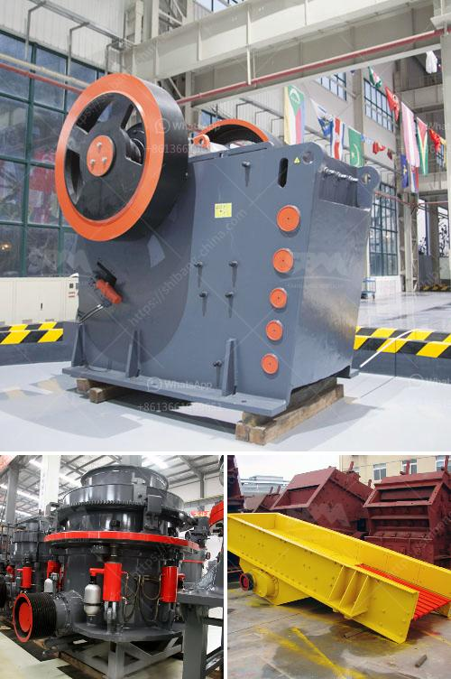

<h3>pe jaw crusher price list</h3>
The price of PE jaw crusher is one of the concerns of customers seeking to purchase it. The jaw crusher offered by Fote Machinery has the highest cost performance among the countless jaw crusher quotations. The production capacity of jaw crusher PEX 250 x 1200 is 20-50 cubic meters per hour, the dimension of material feeding inlet is 250×1200 mm, the largest feeding granularity is 210mm and the discharging mouth is available to adjust within 15-60 mm. With the advantages of high productivity, low operating cost, stable performance and convenient maintenance, PE jaw crusher has attracted more and more attention in the mining industry.

As we all know, jaw crusher is the traditional crushing equipment before the emergence of new types like impact crusher, cone crusher, etc. To process the iron ore, jaw crusher is widely used in various industries such as mining, road and railway construction, building construction,water conservation and chemical industry etc. PE jaw crusher, as the first choice of primary crushing, can be divided into coarse crushing and fine crushing, the feeding size is125mm~1100mm. PE series of jaw crusher have the features of high crushing ratio, even final size, simple structure, reliable working condition, easy maintenance, low operating cost and also have these advantages such as big production capacity, uniform end product size etc.

Various types of jaw crusher models from small to large can be purchased on the jaw crusher price list provided by Fote Machinery. In general, jaw crusher is the primary crushing equipment, and commonly used for crushing big rocks into smaller rocks. Those smaller rocks can be further crushed into smaller particles with other crushers like cone crusher, sand making machine, etc. To sum up, PE jaw crusher has its unique advantages and it has been widely used in various industrial sectors. The jaw crusher price list provided by Fote Machinery is fair and reasonable, which is more in line with the majority of customers' requirements and expectations.
<h3>Contact us</h3><ul><li><strong>Whatsapp:&nbsp;<a href="https://wa.me/8613661969651">+8613661969651</a></strong></li><li><a href="https://swt.shibang-china.com/?git&amp;zhl&amp;pe jaw crusher price list"><strong>Online Service(chat now)</strong></a></li></ul><h3>Related</h3><ul><li><a href='ball mill grinders cost.md'>ball mill grinders cost</a></li><li><a href='flow chart gypsum production.md'>flow chart gypsum production</a></li><li><a href='impact crusher mesh.md'>impact crusher mesh</a></li><li><a href='iron ore beneficiation proposal.md'>iron ore beneficiation proposal</a></li><li><a href='rock screening plants.md'>rock screening plants</a></li></ul>