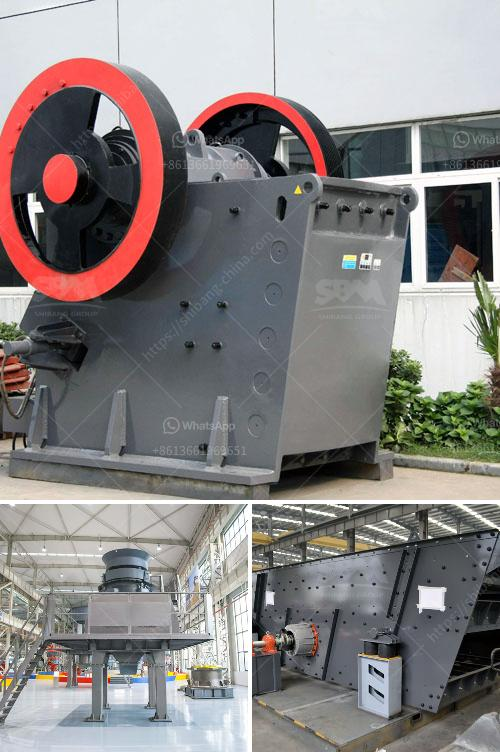

<h3>pe jaw crusher</h3>
The PE jaw crusher is one of the commonly used and widely used crushing equipment in mining machinery. It is mainly used for crushing materials with compressive strength less than 320 MPa. The machine is widely used in mining, building materials, metallurgy, electric power, water conservancy, transportation and many other fields. With its excellent performance and durability, the PE jaw crusher has become the preferred choice of many users.

One of the key advantages of the PE jaw crusher is that it has a solid and durable frame construction. This ensures the crusher can handle heavy loads and remain reliable for long operational hours. The heavy-duty construction also contributes to the crusher's impressive resistance to wear and tear, making it ideal for tough mining and quarrying applications.

Another significant feature of the PE jaw crusher is its efficient and powerful crushing mechanism. The crusher is equipped with a movable jaw plate and a fixed jaw plate, which form a V-shaped cavity. The materials are fed into the cavity through the top of the crusher and are crushed between the two jaw plates. The crushed materials are discharged through the bottom of the machine.

The PE jaw crusher is also known for its high reduction ratio, uniform product size, simple structure, reliable performance, and low operating cost. Its energy-saving design makes it efficient and environmentally friendly. The machine consumes less energy, reduces emissions, and is easy to maintain and repair.

In conclusion, the PE jaw crusher is an excellent primary crusher with a large feed opening, sturdy construction, and exceptional durability. Its efficient and powerful crushing mechanism ensures the high reduction ratio, uniform product size, and low operating cost. It is a reliable and versatile machine that is suitable for various mining and quarrying applications. When it comes to crushing equipment, the PE jaw crusher is a top choice for many industry professionals.
<h3>Contact us</h3><ul><li><strong>Whatsapp:&nbsp;<a href="https://wa.me/8613661969651">+8613661969651</a></strong></li><li><a href="https://swt.shibang-china.com/?git&amp;zhl&amp;pe jaw crusher"><strong>Online Service(chat now)</strong></a></li></ul><h3>Related</h3><ul><li><a href='all model vsi crusher.md'>all model vsi crusher</a></li><li><a href='vertical roller mill for cement grinding.md'>vertical roller mill for cement grinding</a></li><li><a href='pebble stone crusher.md'>pebble stone crusher</a></li><li><a href='artificial sand making.md'>artificial sand making</a></li><li><a href='stone crusher machinery manufacturers.md'>stone crusher machinery manufacturers</a></li></ul>