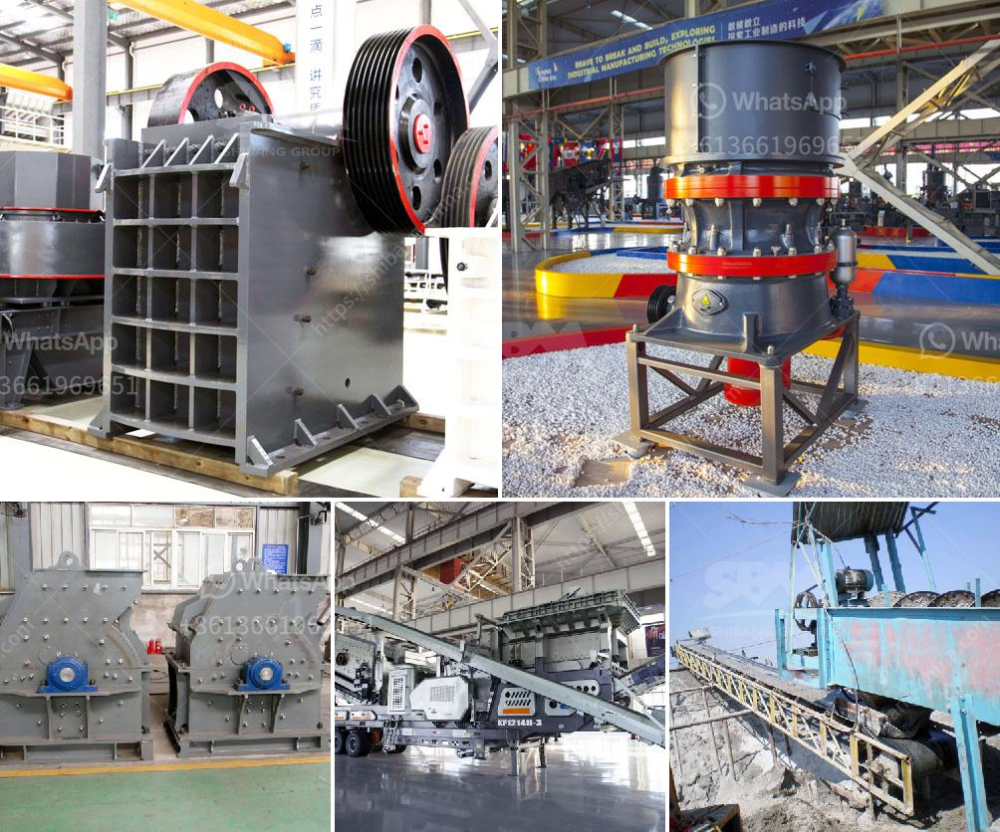

<h3>pebble stone crusher</h3>
Pebble stone crusher, as a kind of machine for producing sand and building material, is often used in industries like construction, water conservancy and mining, etc. Based on the appearance or in accordance with the principles of engineering mechanics, the pebble crusher is often used in the first or second crushing of the materials. Due to its high compressive strength and excellent grain size control, the pebble stone crusher is widely used in a variety of industries.

The pebble stone crusher machine is widely used in mining, smelting, building material, highway, railway, water conservancy and chemical industry and many other industries. Pebble crushing process, the large pebble materials are evenly sent into the jaw crusher by the vibrating feeder for primary crushing, then the crushed materials are sent into the impact crusher or cone crusher by the belt conveyor for secondary crushing. The finely crushed pebbles are sent to the vibrating screen by the belt conveyor, and the sieve particle size is sieved out. Qualified pebbles are transported to the finished product area by belt conveyor, and the oversized pebbles are returned to the impact crusher or cone crusher for re-crushing.

The pebble stone crusher machine has advantages such as crushing ratio, high efficiency, low energy consumption and uniform product size. It is suitable for crushing materials with compressive strength not higher than 320MPa, which can be used for coarse crushing in mines. , metallurgy, building materials, highways, railways, water conservancy and chemical industries, etc., with various product sizes and high crushing requirements.

However, since the pebble stone crusher has been improved continuously, it has developed into a new type of high-efficiency, energy-saving and environmental machine. For example, the mobile crushing machine, equipped with a re-traction function and a hydraulic device, is demanded more in the market. The crushing ratio of the machine is large, the particle size is uniform, the wear of vulnerable parts is small, and the overall energy consumption is low.

In conclusion, the pebble stone crusher machine is a good helper for users. It has helped the manufacturers to get rid of the lengthy and complicated process of line configuration and has created favorable conditions for the entire construction industry. With the continuous advancement of technology, various machinery and equipment have been continuously improved, and the use of pebble stone crusher machines continues to be optimized, which will bring higher economic benefits to users.
<h3>Contact us</h3><ul><li><strong>Whatsapp:&nbsp;<a href="https://wa.me/8613661969651">+8613661969651</a></strong></li><li><a href="https://swt.shibang-china.com/?git&amp;zhl&amp;pebble stone crusher"><strong>Online Service(chat now)</strong></a></li></ul><h3>Related</h3><ul><li><a href='stone crusher in nairobi for sale.md'>stone crusher in nairobi for sale</a></li><li><a href='silica sand price per ton.md'>silica sand price per ton</a></li><li><a href='grinding equipment and machinery.md'>grinding equipment and machinery</a></li><li><a href='gravity gold recovery mill.md'>gravity gold recovery mill</a></li><li><a href='copper ore processing.md'>copper ore processing</a></li></ul>