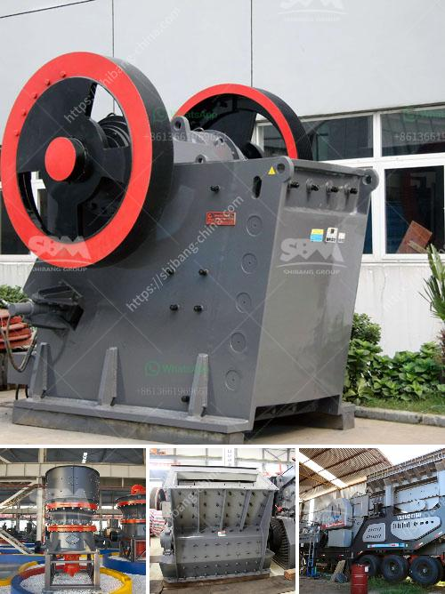

<h3>pebble stone processing machines</h3>
Pebble stones are widely used in various applications, from landscaping to construction. These smooth, rounded stones can add a distinctive touch to any project, but their processing requires specialized machinery to ensure efficiency and high-quality output. Enter pebble stone processing machines, designed to streamline the production process and maximize productivity.

One key machine utilized in pebble stone processing is the vibrating feeder. This essential equipment evenly feeds the stones into the primary jaw crusher or impact crusher, ensuring a consistent flow of pebble stones throughout the production line. By automating the feeding process, the vibrating feeder eliminates the need for manual labor, reducing labor costs and increasing overall efficiency.

After the initial crushing stage, pebble stones undergo further processing in secondary and tertiary crushers. These machines, such as cone crushers or impact crushers, break down the pebble stones into smaller sizes, which can then be separated by screens and classified according to specified requirements.

To achieve a polished finish, pebble stones often undergo polishing processes in specialized machines. Polishing machines utilize rotating drums or tumblers that gently tumble the stones, gradually wearing away rough edges and enhancing their natural beauty. These machines can be equipped with different abrasives or polishing compounds, allowing for customization and achieving desired surface finishes.

Furthermore, water recycling systems are an integral part of pebble stone processing machines. As water is an essential component for the finishing processes, recycling systems ensure that water is efficiently reused, reducing water consumption and minimizing environmental impact.

Pebble stone processing machines have revolutionized the industry by enhancing both the efficiency and quality of production. These machines not only reduce manual labor but also increase productivity, allowing manufacturers to meet growing demands. By incorporating automation and water recycling systems, these machines also contribute to sustainable practices.

In conclusion, pebble stone processing machines play a crucial role in the production of superior quality pebble stones. Their efficiency, automation, and advanced processes have transformed the industry, allowing for faster, more cost-effective, and eco-friendly stone processing. With the utilization of these specialized machines, manufacturers can meet the high standards and demands of diverse applications, ranging from landscaping to architectural projects.
<h3>Contact us</h3><ul><li><strong>Whatsapp:&nbsp;<a href="https://wa.me/8613661969651">+8613661969651</a></strong></li><li><a href="https://swt.shibang-china.com/?git&amp;zhl&amp;pebble stone processing machines"><strong>Online Service(chat now)</strong></a></li></ul><h3>Related</h3><ul><li><a href='used gold washing machines.md'>used gold washing machines</a></li><li><a href='sand manufacturing machines china.md'>sand manufacturing machines china</a></li><li><a href='quarry crusher machines italy.md'>quarry crusher machines italy</a></li><li><a href='china mineral ore processing mill ball.md'>china mineral ore processing mill ball</a></li><li><a href='quarry stone crusher for sale in south africa.md'>quarry stone crusher for sale in south africa</a></li></ul>