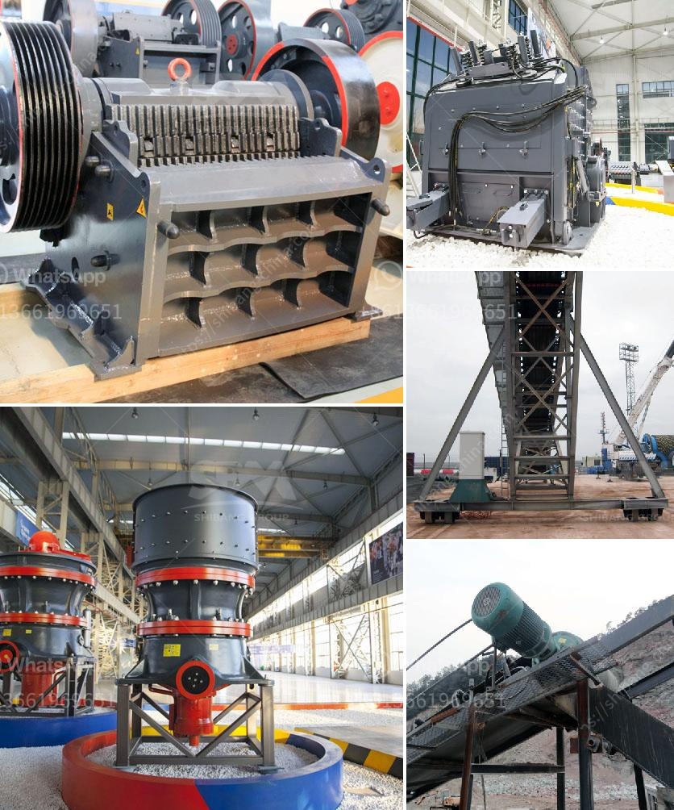

<h3>pictures of coal mining equipment</h3>
Coal mining has been a crucial industry for centuries, playing a significant role in powering nations across the world. From driving industrialization to fueling electricity generation, coal has been an essential energy source. The importance of coal mining equipment cannot be overstated, as these machines are the backbone of the industry. In this article, we will explore the significance of pictures showcasing coal mining equipment, providing a glimpse into the machinery that powers the world.

Coal mining equipment encompasses a wide array of machinery, each with a distinct purpose and function in the mining process. One such example is the continuous miner, a machine responsible for cutting coal and loading it onto a conveyor belt. As the name suggests, continuous miners work tirelessly to extract coal from underground mines, making them invaluable assets in the industry. Pictures of these colossal machines give viewers a sense of their enormous size and power, emphasizing the physical magnitude of the coal mining process.

Another prominent piece of equipment captured in these pictures is the longwall shearer. This machine's primary role is cutting the coal from the underground seam in a methodical and efficient manner. Its design allows the longwall shearer to operate in a continuous line, cutting the coal while simultaneously protecting the safety of the miners. Pictures showcasing longwall shearers provide onlookers with an understanding of how coal is extracted systematically, ensuring minimal disruption to the geological structure.

In addition to the cutting-edge machinery, pictures of coal mining equipment often reveal the intricate network of conveyors and transport systems. These systems play a vital role in efficiently moving the extracted coal from the mining site to storage facilities or even directly to power plants. By observing these photographs, viewers can appreciate the complex logistical infrastructure necessary for coal to reach its final destination and contribute to the global energy supply.

Beyond the machinery itself, pictures of coal mining equipment also shed light on the arduous conditions faced by miners in their daily work. These images offer a glimpse into the challenging environment these workers contend with, such as cramped spaces, extreme temperatures, and potential safety hazards. Thus, these pictures serve as a reminder of the sacrifices made by coal miners to provide societies with the energy they need.

Moreover, pictures of coal mining equipment prompt discussions on the environmental impact of the industry. While coal mining has powered economies for centuries, it has also raised concerns about pollution and climate change. The juxtaposition of these machines against the backdrop of natural landscapes invites contemplation on the balance between energy needs and environmental preservation.

In conclusion, pictures of coal mining equipment provide a fascinating insight into the machinery that fuels the world. By showcasing the massive size and power of these machines, these images illustrate the magnitude of the coal mining process. They also shed light on the complex logistical infrastructure involved in transporting coal from the extraction site to its final destination. Furthermore, these pictures evoke discussions about the challenging conditions faced by miners and the environmental impact of the industry. Through these images, we gain a better understanding of the vital role that coal mining equipment plays in powering nations around the globe.
<h3>Contact us</h3><ul><li><strong>Whatsapp:&nbsp;<a href="https://wa.me/8613661969651">+8613661969651</a></strong></li><li><a href="https://swt.shibang-china.com/?git&amp;zhl&amp;pictures of coal mining equipment"><strong>Online Service(chat now)</strong></a></li></ul><h3>Related</h3><ul><li><a href='process chart of sand washing plant.md'>process chart of sand washing plant</a></li><li><a href='crushing of iron ore.md'>crushing of iron ore</a></li><li><a href='price of stone crusher stone crusher.md'>price of stone crusher stone crusher</a></li><li><a href='mobile crushers for sale uk.md'>mobile crushers for sale uk</a></li><li><a href='slinger conveyor belt speed.md'>slinger conveyor belt speed</a></li></ul>