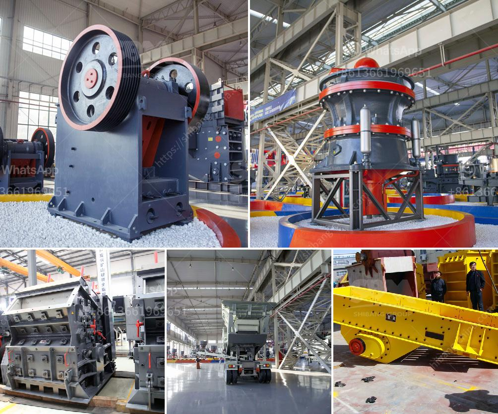

<h3>pine cone coal manufacturing machinery</h3>
As the world veers towards more sustainable ways of living, the search for renewable sources of energy continues to gain momentum. While solar and wind energy have been at the forefront of this movement, recent advancements in technology have unveiled an unexpected source: pine cone coal. This innovative manufacturing machinery harnesses the potential of pine cones to produce a renewable coal-like fuel, providing a promising solution to address the global energy crisis. In this article, we delve into the workings and benefits of the pine cone coal manufacturing machinery.

The pine cone coal manufacturing machinery is a groundbreaking invention that transforms traditional coal production. By utilizing pine cones as the primary resource, this machinery offers an environmentally friendly alternative to conventional coal manufacturing. Developed by a team of scientists and engineers, the machinery integrates cutting-edge processes to extract and convert the energy-dense properties of pine cones into coal-like fuel.

The manufacturing process begins with the collection of ripe pine cones from forests or plantations. These naturally abundant pine cones are then fed into the machinery, where they undergo a series of mechanical actions. The machinery carefully destalks, cleans, and dries the cones, preparing them for the next step. Once dried, the cones are subjected to a thermal treatment process known as pyrolysis. This process involves the controlled heating of the pine cones in the absence of oxygen, which promotes the release of volatile substances and creates a carbon-rich substance resembling coal – pine cone coal.

a) Sustainable and renewable: The pine cone coal manufacturing machinery caters to the growing demand for renewable energy sources. While traditional coal production has significant environmental impacts and contributes to climate change, pine cone coal is entirely sustainable. Pine cones are replenished naturally, making this machinery an excellent alternative to non-renewable resources.

b) Reduced emissions: Compared to traditional coal, pine cone coal contains lower concentrations of harmful compounds, such as sulfur and heavy metals. When used for energy production, it significantly reduces greenhouse gas emissions and air pollutants, mitigating the adverse effects on both climate and human health.

c) Economic opportunities: The development and implementation of pine cone coal manufacturing machinery presents an opportunity for rural communities to generate income. Pine cone collection and processing can become a thriving economic activity, particularly in areas with ample pine cone resources, thus promoting local employment and sustainable development.

d) Versatile applications: Pine cone coal shares similarities with traditional coal, making it suitable for various applications. It can be used as a fuel source for power generation, conversion into biofuels, or as a raw material for industrial processes that traditionally rely on fossil fuels.

The advent of pine cone coal manufacturing machinery is a significant leap towards a more sustainable and greener future. Utilizing the abundant and renewable resources of pine cones, this revolutionary technology offers an alternative to traditional coal production. With its reduced environmental impact, potential economic opportunities, and versatility, pine cone coal presents a promising solution to address the energy needs of a rapidly evolving world. As research and development continue to refine the machinery's efficiency and effectiveness, we can look forward to a future driven by renewable energy from unexpected sources like the resilient pine cone.
<h3>Contact us</h3><ul><li><strong>Whatsapp:&nbsp;<a href="https://wa.me/8613661969651">+8613661969651</a></strong></li><li><a href="https://swt.shibang-china.com/?git&amp;zhl&amp;pine cone coal manufacturing machinery"><strong>Online Service(chat now)</strong></a></li></ul><h3>Related</h3><ul><li><a href='machinery needed for limestone extraction.md'>machinery needed for limestone extraction</a></li><li><a href='japan mobile stone crusher machine.md'>japan mobile stone crusher machine</a></li><li><a href='4 raymond roller mill.md'>4 raymond roller mill</a></li><li><a href='limestone crushing.md'>limestone crushing</a></li><li><a href='super fine grinding machine price in india.md'>super fine grinding machine price in india</a></li></ul>