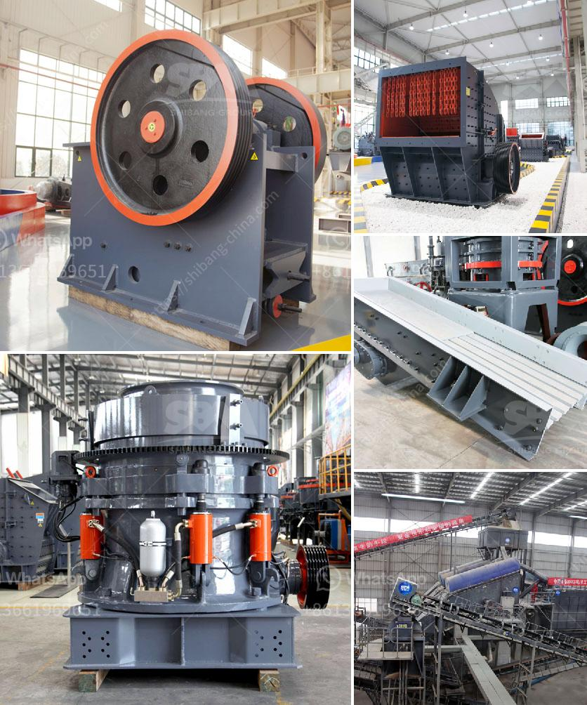

<h3>pioneer ve rock crusher</h3>
The Pioneer VE Rock Crusher is a powerful and versatile piece of equipment that can instantly transform rocky terrain into smooth and easily navigable ground. This innovative product utilizes a crushing mechanism to break down rocks and stones into smaller, more manageable pieces, making it ideal for construction, landscaping, and agricultural purposes. With its robust design and efficient operation, the Pioneer VE Rock Crusher is a game-changer in the field of rock crushing.

One of the key features of the Pioneer VE Rock Crusher is its versatility. Equipped with a powerful engine and heavy-duty components, it can crush rocks of various sizes and hardness levels. From large boulders to small pebbles, this machine can handle them all. This makes it an invaluable tool for a wide range of projects, including road construction, building foundations, and even backyard improvements.

Furthermore, the Pioneer VE Rock Crusher is designed for ease of use and minimal maintenance. The controls are intuitive and user-friendly, allowing operators of all experience levels to operate the machine efficiently. Additionally, the machine's robust build ensures durability and long-lasting performance, reducing the need for frequent repairs or replacements. This not only saves time and money but also increases overall productivity.

Another significant advantage of the Pioneer VE Rock Crusher is its environmental compatibility. Traditional rock crushing methods often involve the use of explosives, which can pose a danger to the environment due to noise, air, and ground vibrations. In contrast, the Pioneer VE Rock Crusher operates silently and does not require any blasting or drilling. This makes it a more sustainable option, ensuring minimal disruption to nearby residential areas or natural habitats.

The Pioneer VE Rock Crusher also offers enhanced mobility, making it easy to transport from one job site to another. Designed to fit on trailers or trucks, this compact machine can be quickly set up and put into operation whenever and wherever it is needed. Whether on rough terrains or through narrow access points, the Pioneer VE Rock Crusher can maneuver effortlessly, making it a versatile and reliable solution for various terrain conditions.

In conclusion, the Pioneer VE Rock Crusher is a powerful and efficient solution for rock crushing needs. With its versatility, ease of use, and environmental compatibility, it proves to be a valuable asset for construction, landscaping, and agricultural projects. By breaking down rocks of different sizes and hardness levels, it enables smoother and safer work processes while reducing time and labor requirements. Investing in the Pioneer VE Rock Crusher will not only improve productivity but also contribute to a more sustainable and environmentally-friendly operation.
<h3>Contact us</h3><ul><li><strong>Whatsapp:&nbsp;<a href="https://wa.me/8613661969651">+8613661969651</a></strong></li><li><a href="https://swt.shibang-china.com/?git&amp;zhl&amp;pioneer ve rock crusher"><strong>Online Service(chat now)</strong></a></li></ul><h3>Related</h3><ul><li><a href='rolling ball mills manufacturer.md'>rolling ball mills manufacturer</a></li><li><a href='small rock crusher for sale.md'>small rock crusher for sale</a></li><li><a href='wet grinder price in nigeria.md'>wet grinder price in nigeria</a></li><li><a href='jaw crusher for sale kenya.md'>jaw crusher for sale kenya</a></li><li><a href='rock crusher for excavator.md'>rock crusher for excavator</a></li></ul>