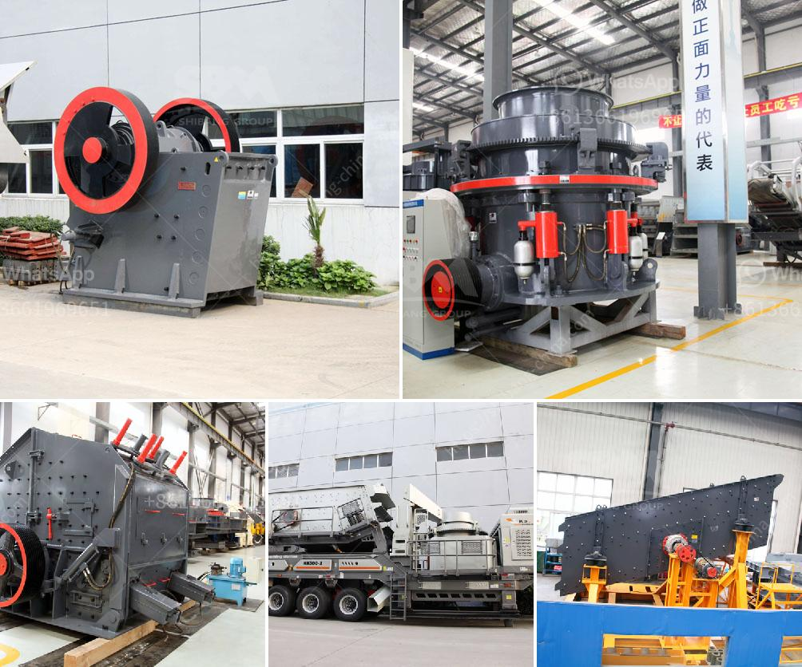

<h3>plamnta mobile stone crusher</h3>
In today's fast-paced and competitive world, it's all about staying ahead and adapting to the changing trends. As industries continue to develop and grow, the construction sector is no exception. With the increasing demand for infrastructure projects, such as roads, bridges, and buildings, the need for efficient and reliable mobile stone crushers has become paramount.

One such essential tool that has made its mark in this industry is the plant and mobile stone crusher. This powerful machine is designed to reduce large rocks into smaller rocks, gravel, sand, or even dust particles. It plays a vital role in the construction industry as it enables the conversion of raw materials into finished products, ready for use in various construction projects.

The plant and mobile stone crusher offers many advanced features, making it easy and convenient to carry out different crushing tasks. With its state-of-the-art technology, it delivers high-quality products that meet the specific requirements of customers. Its mobility allows it to be easily transported from one location to another, making it ideal for construction sites that require multiple crushing operations.

One of the significant advantages of using a plant and mobile stone crusher is its flexibility. It can quickly adapt to different terrain and work environments, ensuring maximum productivity in any situation. Whether it's working on hilly terrains, remote areas, or tight construction sites, this machine is up for the challenge. Its compact size and maneuverability make it easy to access even the most confined spaces, ensuring that no valuable time is wasted.

Apart from its flexibility, this stone crusher offers high efficiency and productivity. Equipped with powerful crushing mechanisms, it can handle a wide range of materials, including rocks, concrete, asphalt, and bricks. Its ability to process large quantities of material at a rapid pace allows construction projects to be completed faster without compromising on quality. This translates into cost savings and improved overall project timelines.

Furthermore, a plant and mobile stone crusher is designed with safety in mind. Various safety features are incorporated, such as emergency stops, safety guards, and automatic shutdown systems in case of any mechanical malfunction or human error. These features not only protect the operator and the machine but also contribute to a safe and secure working environment for all.

Investing in a plant and mobile stone crusher proves to be a wise choice for construction companies. It offers a range of benefits, including enhanced productivity, versatility, cost-effectiveness, and safety. By incorporating this machinery into their operations, contractors can stay competitive and meet the growing demands of the industry.

In conclusion, a plant and mobile stone crusher is a valuable addition to any construction site. Its ability to crush various materials, adapt to different terrains, and ensure safety and efficiency make it a game-changer for the construction industry. With the demand for infrastructure projects on the rise, investing in this versatile machine is a smart move for any forward-thinking construction company.
<h3>Contact us</h3><ul><li><strong>Whatsapp:&nbsp;<a href="https://wa.me/8613661969651">+8613661969651</a></strong></li><li><a href="https://swt.shibang-china.com/?git&amp;zhl&amp;plamnta mobile stone crusher"><strong>Online Service(chat now)</strong></a></li></ul><h3>Related</h3><ul><li><a href='second hand quarry crusher machinery price in india.md'>second hand quarry crusher machinery price in india</a></li><li><a href='stone crusher plant ton jam.md'>stone crusher plant ton jam</a></li><li><a href='micro grinding machine.md'>micro grinding machine</a></li><li><a href='stone crusher machinery manufacturers.md'>stone crusher machinery manufacturers</a></li><li><a href='550 used cone crusher for sale.md'>550 used cone crusher for sale</a></li></ul>