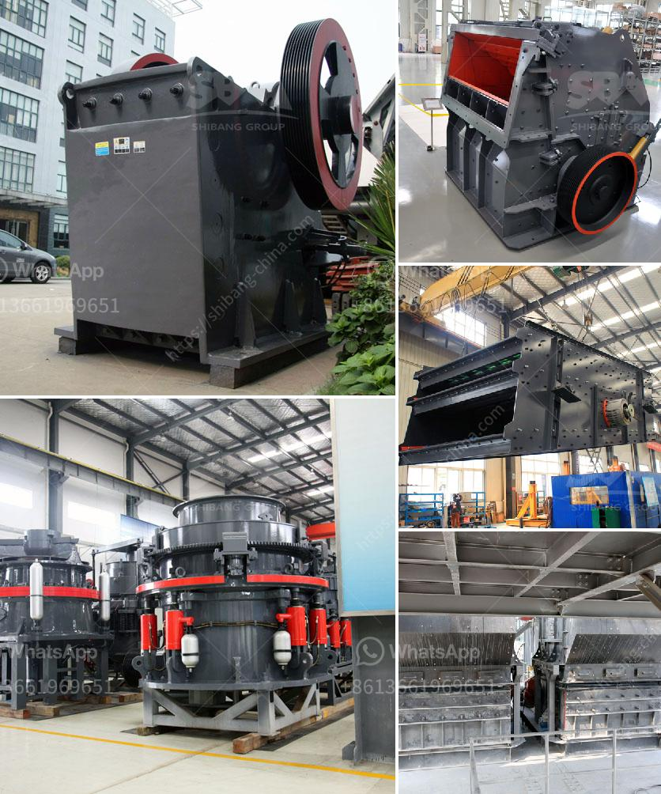

<h3>portable concrete crusher for rent qatar</h3>
The importance of concrete in modern society cannot be underestimated. Concrete is used in virtually every construction project, from roads to buildings to bridges. It plays a vital role in our infrastructure and economy.

However, concrete is heavy and bulky, making it difficult to transport and use. This is where portable concrete crushers come into play. These innovative crushers are designed to process concrete on-site, reducing transportation costs and ensuring the concrete is readily available for use.

The crushers are also environmentally friendly, as they eliminate the need for landfill disposal of demolished concrete materials. Additionally, they offer a cost-effective solution, as contractors can reuse the recycled concrete onsite rather than purchasing expensive aggregate materials.

In Qatar, the construction industry has seen a boom in recent years due to the growing population and the need for new infrastructure projects. To meet the increasing demand for concrete, contractors are utilizing portable crushers to recycle the concrete at the construction site itself. This reduces construction costs as well as the pollution caused by transportation and landfill disposal.

Qatar's leading construction companies are finding immense benefit from using portable crushers to recycle waste concrete. In fact, they are increasingly relying on portable crushers to process concrete from demolition projects, bringing the concrete to sites where it can be reused.

Mobile concrete crushers are suitable for primary and secondary crushing of concrete waste. They can also be used for recycling concrete and asphalt, production of aggregates and other construction materials. Portable concrete crushers are configured with hydraulic and feeding system, ensuring an easy and fast installation.

The rental terms regarding these machines are also flexible, ensuring that users can easily crush concrete on-site according to project requirements. These machines can be easily transported from one job site to another, saving time and effort.

In conclusion, portable concrete crushers for rent qatar provide a viable solution to the challenges associated with crushing concrete at construction sites. It is an economic and convenient way to achieve concrete recycling at construction sites. The benefits of using portable crushers in Qatar are evident – reduction in transportation costs, improved productivity, and lower maintenance costs. Additionally, it also contributes to environmental protection by recycling demolished materials into new construction materials.
<h3>Contact us</h3><ul><li><strong>Whatsapp:&nbsp;<a href="https://wa.me/8613661969651">+8613661969651</a></strong></li><li><a href="https://swt.shibang-china.com/?git&amp;zhl&amp;portable concrete crusher for rent qatar"><strong>Online Service(chat now)</strong></a></li></ul><h3>Related</h3><ul><li><a href='limestone ball mill in egypt.md'>limestone ball mill in egypt</a></li><li><a href='sand manufacturing machines china.md'>sand manufacturing machines china</a></li><li><a href='basalt crusher supplier.md'>basalt crusher supplier</a></li><li><a href='small cone crusher for sale za.md'>small cone crusher for sale za</a></li><li><a href='best grinding mills of chslk limestone.md'>best grinding mills of chslk limestone</a></li></ul>