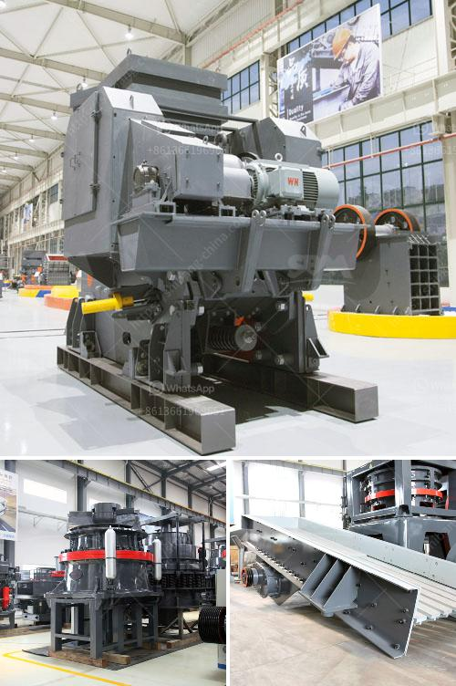

<h3>portable concrete crusher south africa</h3>
Portable Concrete Crusher South Africa is the leading equipment in the mining machinery industry. With the development of urbanization, there are a lot of building materials needed in the construction market, such as aggregate, concrete, asphalt, etc. To meet this demand, the development of portable crusher plants has become a popular choice around the world.

Portable concrete crusher South Africa is the overseas representative body of construction and mining machinery manufacturers in China located in Shanghai. As a joint venture funded by local manufacturers in Shanghai, the company has an excellent reputation due to its comprehensive quality control measures, reasonable pricing policies, and strong technical support.

The portable concrete crusher South Africa has a capacity of 10-500+ tons per hour. The maximum feed size is 150-200 mm, and the discharge size is 10-40 mm. It has excellent performance and is a reliable and high-quality crushing station that can carry out crushing and screening operations for various rocks, ores, and bulk materials with a compressive strength of up to 320 MPa.

The portable concrete crusher South Africa has a good crushing effect and high production efficiency. It is equipped with an intelligent operating system, which can realize real-time monitoring of the discharge port, temperature and other functions to ensure stable operation and reliable performance. The remote control system can remotely control the operation of the equipment, reducing labor costs and improving work efficiency.

The portable concrete crusher South Africa has a variety of materials processed including limestone, granite, basalt, etc., as well as construction waste such as concrete, bricks, and roadbed materials. The portable concrete crusher is used to crush these materials into pieces. Proven by practice, there are three models of portable concrete crushers for sale in South Africa, namely, PE series jaw crusher, PFW series impact crusher, and PF series impact crusher.

These three types of crushing equipment are commonly used by users. Among them, the PE series jaw crusher is a coarse crushing equipment commonly used for primary crushing, and the PFW series impact crusher is a secondary crusher, with excellent performance and good grain shape. The PF series impact crusher has a larger feed size, which can break materials with a compressive strength of no more than 350 MPa.

In summary, the investment in the Portable Concrete Crusher South Africa has good prospects for development, and is a good investment choice for construction waste crushing. The service life of Portable Concrete Crushers is greatly shortened, and it is more suitable for construction waste treatment and output. In addition, the comprehensive supporting measures and service support provided by Portable Concrete Crusher Manufacturers ensure the benefits of customers. Portable Concrete Crushers are sold around the world, with South Africa being one of the leading producers.
<h3>Contact us</h3><ul><li><strong>Whatsapp:&nbsp;<a href="https://wa.me/8613661969651">+8613661969651</a></strong></li><li><a href="https://swt.shibang-china.com/?git&amp;zhl&amp;portable concrete crusher south africa"><strong>Online Service(chat now)</strong></a></li></ul><h3>Related</h3><ul><li><a href='start a stone crusher.md'>start a stone crusher</a></li><li><a href='ball mill grinders cost.md'>ball mill grinders cost</a></li><li><a href='granite quarry crushing plant.md'>granite quarry crushing plant</a></li><li><a href='50tpd mini cement plant cost in india.md'>50tpd mini cement plant cost in india</a></li><li><a href='gold corporation ball mill.md'>gold corporation ball mill</a></li></ul>