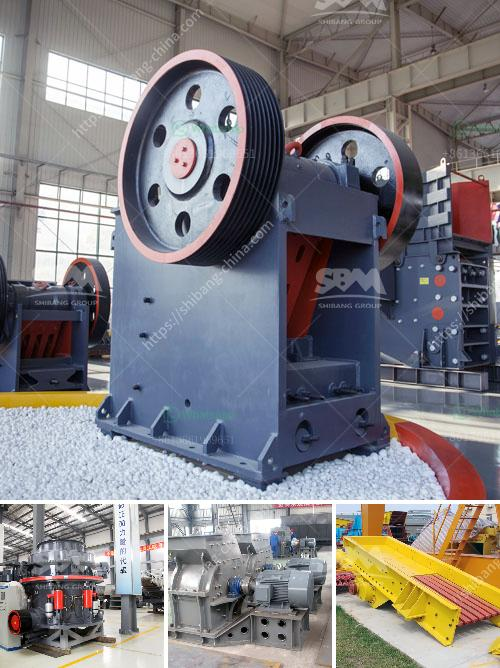

<h3>portable concrete milling machines</h3>
In the world of construction, efficiency is of paramount importance. Contractors are constantly seeking innovative solutions and advanced technologies to improve their productivity and reduce project timeframes. One such tool that has revolutionized the construction industry is the portable concrete milling machine. With its versatility and efficiency, these machines have become an indispensable tool for any construction project.

Portable concrete milling machines are compact, powerful, and capable of handling a wide range of applications. They are designed to remove concrete surfaces quickly and efficiently, providing a smooth and even finish. These machines are particularly useful in road construction, pavement rehabilitation, and repairing damaged concrete surfaces.

Equipped with rotating drum cutters or milling heads, portable concrete milling machines can remove layers of concrete with incredible precision. The milling depth can be easily adjusted, allowing contractors to choose the desired thickness of material removal. This feature makes it ideal for projects requiring selective concrete removal or surface preparation for overlays.

One of the significant advantages of portable concrete milling machines is their ease of use and mobility. They are designed to be compact and lightweight, making transportation easy from one construction site to another. This portability not only saves time but also reduces project costs associated with transporting heavy machinery or outsourcing concrete milling services.

Moreover, these machines are user-friendly, requiring minimal training for operation. Their intuitive controls enable contractors to achieve accurate and consistent concrete removal without the need for extensive experience. Contractors can conveniently adjust the milling speed, cutter rotation, and depth, tailoring the machine's performance to meet specific project requirements.

Portable concrete milling machines are also preferred because they offer versatile milling options. They can remove concrete from horizontal surfaces such as roads, walkways, and parking lots, as well as vertical surfaces like walls and bridge decks. This versatility allows contractors to tackle a wide variety of projects, saving them the expense of investing in specialized machinery for specific applications.

Furthermore, portable concrete milling machines are equipped with advanced dust collection systems, promoting a healthier work environment. These systems efficiently capture and contain the concrete dust produced during milling operations. Not only does this enhance operator safety by minimizing exposure to harmful dust particles, but it also reduces the impact on the surrounding environment.

In conclusion, portable concrete milling machines have revolutionized the construction industry by offering contractors an efficient, versatile, and user-friendly solution for concrete removal and surface preparation. These machines not only save time and money but also improve project quality by providing precise and consistent results. With their compact size and mobility, contractors can easily transport these machines and use them on various construction sites. As the construction industry continues to evolve, portable concrete milling machines will remain an indispensable tool for any contractor seeking optimal efficiency in their projects.
<h3>Contact us</h3><ul><li><strong>Whatsapp:&nbsp;<a href="https://wa.me/8613661969651">+8613661969651</a></strong></li><li><a href="https://swt.shibang-china.com/?git&amp;zhl&amp;portable concrete milling machines"><strong>Online Service(chat now)</strong></a></li></ul><h3>Related</h3><ul><li><a href='cement unit cost for 150 tons.md'>cement unit cost for 150 tons</a></li><li><a href='coal handling coal transfer by conveyors coal crusher.md'>coal handling coal transfer by conveyors coal crusher</a></li><li><a href='feldspar crusher for sale.md'>feldspar crusher for sale</a></li><li><a href='50 tpd iron crusher machinery cost.md'>50 tpd iron crusher machinery cost</a></li><li><a href='crusher for iron ore.md'>crusher for iron ore</a></li></ul>