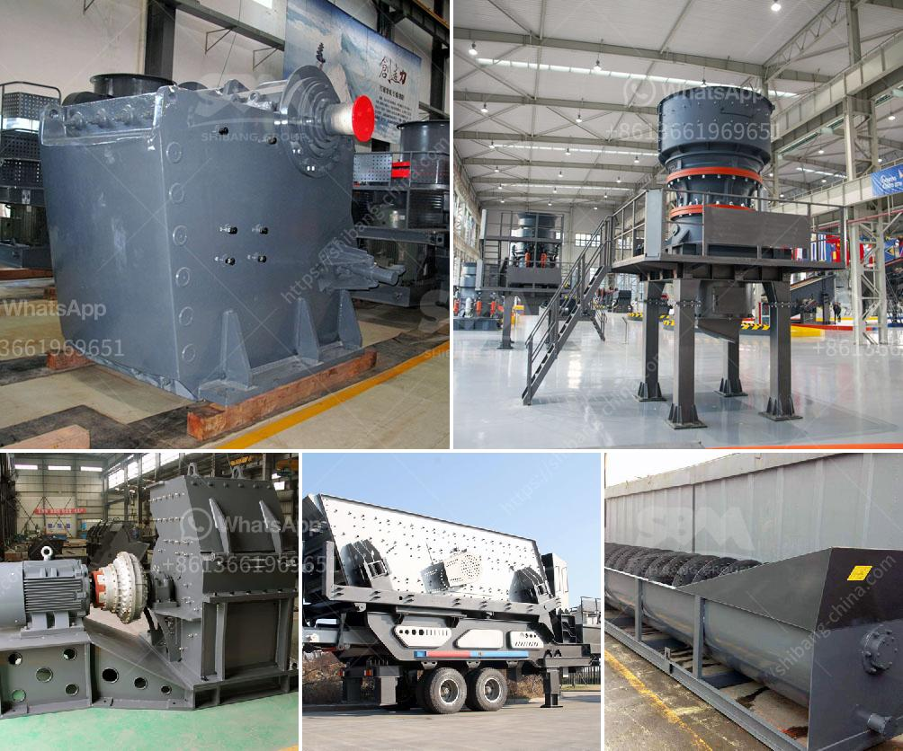

<h3>portable cone crusher specification</h3>
In the field of crushing, the portable cone crusher provides contractors with a unique and versatile tool for on-the-go crushing. Not only does it allow contractors to crush rock on-site, but it also provides them with the flexibility to process much larger volumes of material when compared to traditional crushers. The portable cone crusher specification revolutionizes the crushing industry, offering a wide range of options for fine-tuned crushing applications.

The portable cone crusher is known for its high crushing ratio, uniform product size, and low energy consumption. Additionally, it is ideal for tackling hard and abrasive materials, making it a popular choice in the mining and construction industries. In order to meet the specific requirements of different crushing tasks, the portable cone crusher specification can be customized to fit various crushing applications, ensuring optimal performance and efficiency.

One of the key features of the portable cone crusher is its ability to be easily transported and set up. Unlike fixed crushers, which require significant infrastructure and planning to install, portable cone crushers can be assembled and disassembled in a matter of hours. This allows contractors to quickly move the crusher to different sites, saving time and money on transportation costs. The compact design of portable cone crushers also makes them easier to maneuver in tight spaces, making them an excellent choice for on-the-go crushing.

When it comes to the specific capabilities and specifications of portable cone crushers, the options are vast. Depending on the model, portable cone crushers can have a variety of crushing chamber profiles, such as standard, short head, and fine crushing chambers. These different profiles allow contractors to adapt the crusher to different materials and achieve the desired product shape and size.

Another important aspect of portable cone crusher specifications is the feed size range. The feed size refers to the maximum size of the material that the crusher can handle. Depending on the model, portable cone crushers can accept feed sizes ranging from a few millimeters to several centimeters, making them suitable for a wide range of applications.

Furthermore, portable cone crushers often come equipped with advanced features to enhance the efficiency and performance of the crushing process. Features such as hydraulic adjustment, tramp release systems, and automation technologies provide operators with greater control and ease of use. These features not only increase productivity but also reduce downtime and improve safety.

In conclusion, the portable cone crusher specification is a game-changer in the field of crushing technology. Its ability to be easily transported and set up, coupled with its versatility and customization options, make it an invaluable tool for contractors in various industries. With its high crushing ratio, uniform product size, and low energy consumption, the portable cone crusher is a reliable and efficient choice for crushing a wide range of materials. As technology continues to evolve, the portable cone crusher specification will undoubtedly continue to innovate and push the boundaries in the crushing industry.
<h3>Contact us</h3><ul><li><strong>Whatsapp:&nbsp;<a href="https://wa.me/8613661969651">+8613661969651</a></strong></li><li><a href="https://swt.shibang-china.com/?git&amp;zhl&amp;portable cone crusher specification"><strong>Online Service(chat now)</strong></a></li></ul><h3>Related</h3><ul><li><a href='coal washing plant manufacturers india.md'>coal washing plant manufacturers india</a></li><li><a href='stone crusher manufacturer in china.md'>stone crusher manufacturer in china</a></li><li><a href='rock crusher zenith.md'>rock crusher zenith</a></li><li><a href='coal seal of coal pulverizer.md'>coal seal of coal pulverizer</a></li><li><a href='quartz crusher for crushing.md'>quartz crusher for crushing</a></li></ul>