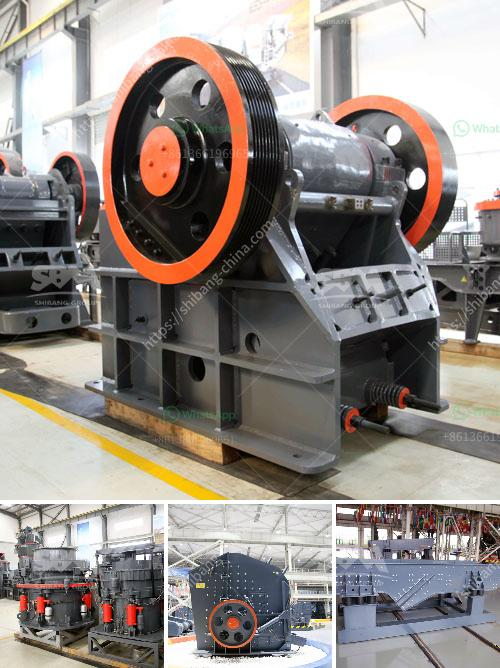

<h3>portable crusher rental in las vegas</h3>
Las Vegas, the entertainment capital of the world, is known for its vibrant nightlife, incredible casinos, and world-class entertainment. However, what many people may not realize is that Las Vegas is also home to a thriving construction industry. With so many ongoing projects and the need for on-site crushing and recycling of materials, portable crusher rental services have become increasingly popular in the city.

A portable crusher is a machine designed to reduce large rocks into smaller rocks, gravel, or rock dust. It can be easily transported and relocated to different job sites, making it perfect for on-site crushing operations. These crushers are equipped with powerful jaws and blades that enable them to break down even the toughest materials, including concrete, asphalt, and natural stone.

One of the main benefits of renting a portable crusher in Las Vegas is the cost savings. Instead of purchasing a crusher, which can be quite expensive, renting allows contractors to access high-quality equipment without the hefty price tag. This is particularly beneficial for smaller companies or those with limited budgets. By renting a crusher, contractors can avoid the upfront costs of purchasing, as well as maintenance and storage fees.

Another advantage of portable crusher rental is the flexibility it offers. Construction projects can be highly dynamic, with changing locations and varying material needs. Renting a crusher allows contractors to adapt quickly to these changes and ensure efficient operations. Portable crushers can be easily transported from one job site to another without the need for specialized equipment or permits. This saves both time and money, as there is no need to hire additional transportation services or wait for permits to be approved.

In addition, portable crusher rental services in Las Vegas often include trained operators. These professionals have years of experience and are well-versed in the operation of crushers. They ensure that the equipment is set up correctly and operated safely, maximizing productivity and minimizing downtime. This eliminates the need for companies to hire and train their own crusher operators, further reducing costs.

When considering portable crusher rental in Las Vegas, it is essential to choose a reputable rental company. Look for a company that has a wide range of crushers available, from jaw crushers to impact crushers and cone crushers. Make sure they regularly service and maintain their equipment to ensure reliability. Additionally, check if they offer flexible rental terms and have a 24/7 customer support line to address any issues that may arise on-site.

In conclusion, portable crusher rental services in Las Vegas provide numerous advantages for contractors in the construction industry. From cost savings and flexibility to access to professional operators, renting a portable crusher is a practical choice for on-site crushing and recycling needs. By partnering with a reputable rental company, contractors can ensure efficient operations and successful project completion. Whether it's demolishing an old building or crushing concrete for reuse in road construction, a portable crusher is the answer to the ever-growing demands of the construction industry in Las Vegas.
<h3>Contact us</h3><ul><li><strong>Whatsapp:&nbsp;<a href="https://wa.me/8613661969651">+8613661969651</a></strong></li><li><a href="https://swt.shibang-china.com/?git&amp;zhl&amp;portable crusher rental in las vegas"><strong>Online Service(chat now)</strong></a></li></ul><h3>Related</h3><ul><li><a href='calcium carbonate milling plant in turkey.md'>calcium carbonate milling plant in turkey</a></li><li><a href='rotary kiln producers in indonesia.md'>rotary kiln producers in indonesia</a></li><li><a href='concrete crushing machine cost.md'>concrete crushing machine cost</a></li><li><a href='crusher machine for sale in pakistan.md'>crusher machine for sale in pakistan</a></li><li><a href='clinker grinding unit prices.md'>clinker grinding unit prices</a></li></ul>