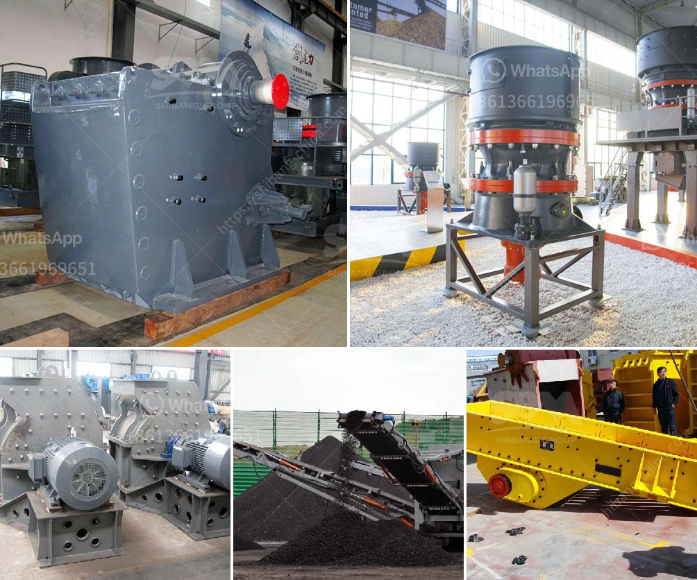

<h3>portable crushers for sale</h3>
Portable crushers are a vital piece of machinery to have on any job site. They offer numerous benefits and are essential in the construction, mining, and quarrying industries. Portable crushers provide contractors with the ability to crush and recycle materials on-site, saving both time and money.

One major advantage of portable crushers is their flexibility. These machines can be transported to different locations easily, allowing contractors to move from one job site to another without any hassle. This flexibility is especially important in remote areas or when multiple sites need to be serviced within a short timeframe. Portable crushers enable contractors to bring the machinery directly to the materials, reducing the need for transportation and the associated costs.

Another benefit of portable crushers is their ability to process a wide range of materials. These machines can crush various types of rocks, concrete, and other aggregates efficiently. They are equipped with robust crushers that can handle even the toughest materials. This versatility allows for increased productivity as contractors can process a variety of materials with a single machine.

Furthermore, portable crushers are environmentally friendly. Traditional crushing methods often involve transporting materials to a central processing facility, resulting in increased fuel consumption and emissions. Portable crushers eliminate the need for transportation, reducing the carbon footprint of the operation. Additionally, these machines can also recycle materials on-site, further contributing to sustainable practices.

In terms of cost-saving, portable crushers prove to be a wise investment. By processing materials on-site, contractors can significantly reduce transportation costs. They can also eliminate the need for purchasing supplementary materials, such as gravel or aggregates, as portable crushers can crush and reuse existing materials. This not only saves money but also minimizes waste and promotes a circular economy.

Moreover, portable crushers greatly enhance productivity. These machines are designed to operate efficiently and deliver consistent results. With the ability to process materials on-site, contractors can avoid delays associated with off-site processing. They can also adjust the size and output of the crushed materials according to their specific requirements, ensuring maximum productivity at all times.

When considering a portable crusher for sale, it is essential to choose a reliable and reputable manufacturer or supplier. Look for a company with a proven track record of delivering high-quality machinery, exceptional customer service, and after-sales support. It is also important to assess the specifications and capabilities of the crusher, ensuring that it meets the specific needs of the project.

In conclusion, portable crushers offer several advantages, making them a valuable asset for any job site. Their flexibility, ability to process diverse materials, and cost-saving benefits make them an ideal choice for construction, mining, and quarrying industries. Moreover, they contribute to sustainable practices by reducing transportation costs, minimizing waste, and promoting on-site recycling. Investing in a portable crusher is a wise decision that can enhance productivity, reduce expenses, and improve overall project efficiency.
<h3>Contact us</h3><ul><li><strong>Whatsapp:&nbsp;<a href="https://wa.me/8613661969651">+8613661969651</a></strong></li><li><a href="https://swt.shibang-china.com/?git&amp;zhl&amp;portable crushers for sale"><strong>Online Service(chat now)</strong></a></li></ul><h3>Related</h3><ul><li><a href='listing price tons per hour screw conveyor.md'>listing price tons per hour screw conveyor</a></li><li><a href='rolling ball mills manufacturer.md'>rolling ball mills manufacturer</a></li><li><a href='top mining equipment supplier in south africa.md'>top mining equipment supplier in south africa</a></li><li><a href='ton per day crusher barmac.md'>ton per day crusher barmac</a></li><li><a href='modeling of power mill ball.md'>modeling of power mill ball</a></li></ul>