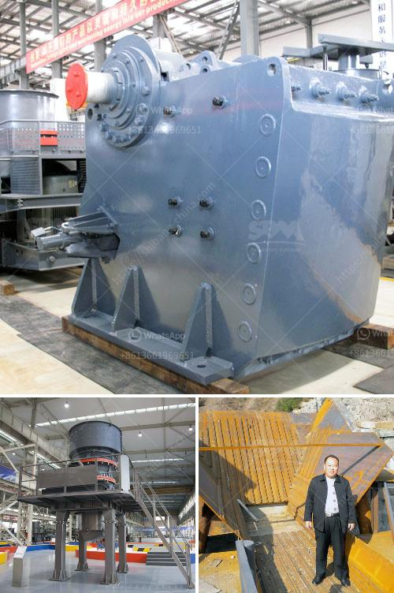

<h3>portable crushing and screening plant</h3>
As the demand for recycled materials continues to grow, so does the need for more efficient and cost-effective methods of recycling. A portable crushing and screening plant is one such solution that offers enhanced efficiency and flexibility to operators. Whether it is recycling concrete or reducing the size of materials on a construction site, this portable plant can be easily transported from one location to another, allowing for quick and convenient processing.

One of the key advantages of a portable crushing and screening plant is its ability to move with ease. By being portable, the plant can be set up at a site and quickly moved to another location as needed. This saves time and resources, as operators can get their crushing and screening operations up and running in a short amount of time, minimizing downtime. With this flexibility, the portable plant can also adapt to different types of materials, allowing operators to handle various recycling jobs efficiently.

In addition to its mobility, the portable crushing and screening plant offers a range of features that contribute to its effectiveness. The plant is equipped with advanced technology for screening and crushing operations. It can handle a wide range of materials, including concrete, bricks, asphalt, and more, with different sizes and shapes. This versatility ensures that operators can process a variety of materials efficiently, reducing the need for multiple machines or processes.

Another advantage of a portable crushing and screening plant is its cost-effectiveness. By using a single unit for all recycling operations, operators can avoid the expenses associated with multiple machines and their maintenance. Furthermore, the plant operates on fuel-efficient engines that help reduce operating costs in the long run. Additionally, its compact size allows for easy transportation and reduces transportation costs.

In conclusion, a portable crushing and screening plant offers an efficient and flexible solution for recycling operations. Its mobility allows for quick and convenient setup at different locations, while its advanced technology and versatility make it suitable for various materials and sizes. With cost-effective operations and reduced downtime, this portable plant is becoming an essential tool for operators in the recycling industry.
<h3>Contact us</h3><ul><li><strong>Whatsapp:&nbsp;<a href="https://wa.me/8613661969651">+8613661969651</a></strong></li><li><a href="https://swt.shibang-china.com/?git&amp;zhl&amp;portable crushing and screening plant"><strong>Online Service(chat now)</strong></a></li></ul><h3>Related</h3><ul><li><a href='mobile crusher hire in uae.md'>mobile crusher hire in uae</a></li><li><a href='calcite costing of processing equipment.md'>calcite costing of processing equipment</a></li><li><a href='mobile crusher in dubai.md'>mobile crusher in dubai</a></li><li><a href='second hand jaw crushers in holland.md'>second hand jaw crushers in holland</a></li><li><a href='canber de broage ciment.md'>canber de broage ciment</a></li></ul>