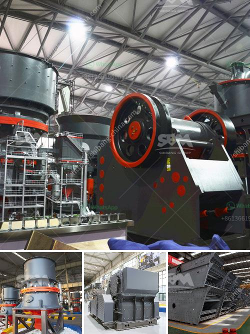

<h3>portable crushing plant</h3>
In the fast-paced construction industry, having the right equipment is crucial to ensuring efficiency and productivity on the job site. One important piece of machinery that has revolutionized the way construction projects are carried out is the portable crushing plant. This innovative solution allows construction companies to easily transport and set up their crushing equipment at different sites, making it a convenient and cost-effective option.

A portable crushing plant is essentially a mobile crushing and screening device, which is designed to process minerals or rocks into smaller, more manageable sizes. It can be used for various types of raw materials, including concrete, asphalt, limestone, sand, gravel, and more. The plant consists of different crushing and screening machines, such as a primary crusher, a secondary crusher, a vibrating screen, and a conveying system. These machines work together to break down the larger rocks or materials into smaller pieces, making them suitable for further processing or use as a final product.

One of the main advantages of a portable crushing plant is its flexibility and mobility. Unlike traditional stationary crushers, which are permanently installed at a single location, portable crushing plants can be easily transported to different sites. This allows construction companies to bring their crushing equipment directly to the work area, eliminating the need for excessive transportation of materials back and forth. As a result, the time and cost associated with transportation are significantly reduced, leading to increased efficiency and cost savings.

Another benefit of a portable crushing plant is its ability to be set up quickly and easily. These plants are designed to be self-contained, meaning they are equipped with their own power source and do not require external power or infrastructure. This allows construction companies to quickly install and start operating their crushing equipment, minimizing downtime and maximizing productivity on the job site. Additionally, the modular design of portable crushing plants allows for easy customization and expansion, making it possible to meet specific project requirements.

Furthermore, a portable crushing plant offers environmental benefits as well. By processing materials on-site, there is less need for transportation, which reduces carbon emissions and air pollution. Additionally, using recycled materials as feedstock can help reduce the need for virgin resources, promoting a more sustainable approach to construction.

In summary, a portable crushing plant is a valuable tool for construction companies looking to improve efficiency and productivity on their job sites. Its flexibility, mobility, quick setup, and environmental benefits make it an attractive option for a wide range of applications. With the ability to process various types of materials, a portable crushing plant is a versatile and cost-effective solution that can greatly enhance the construction process. So, if you are in the construction industry, consider investing in a portable crushing plant for your next project, and reap the benefits it has to offer.
<h3>Contact us</h3><ul><li><strong>Whatsapp:&nbsp;<a href="https://wa.me/8613661969651">+8613661969651</a></strong></li><li><a href="https://swt.shibang-china.com/?git&amp;zhl&amp;portable crushing plant"><strong>Online Service(chat now)</strong></a></li></ul><h3>Related</h3><ul><li><a href='used silica sand washing plant for sale.md'>used silica sand washing plant for sale</a></li><li><a href='sample method statement stone crushing.md'>sample method statement stone crushing</a></li><li><a href='grinder machine for fine powder.md'>grinder machine for fine powder</a></li><li><a href='concrete crusher hire price in south africa.md'>concrete crusher hire price in south africa</a></li><li><a href='ultrafine pulverizer.md'>ultrafine pulverizer</a></li></ul>