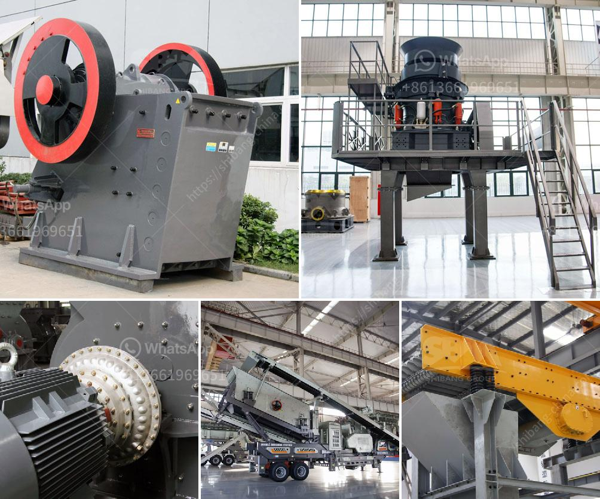

<h3>portable screening and drying sand</h3>
In the construction and civil engineering industries, sand is a crucial material used for a variety of purposes, ranging from creating concrete to filling up trenches. However, before it can be effectively utilized, sand often needs to undergo a process of screening and drying. Traditional methods often involve large machinery and fixed installations, making it challenging to conduct these processes in remote locations or smaller construction projects. However, with advancements in technology, portable screening and drying solutions have emerged, providing a more efficient and flexible approach.

Portable screening equipment, also known as portable sand screens, offer a compact and versatile solution for industries that require on-site sand screening. These machines are designed to efficiently separate different size fractions of sand, ensuring a consistent and high-quality product. Some portable screens are equipped with multiple decks, enabling the separation of multiple sand sizes simultaneously. This allows operators to easily adjust the screening process to meet specific project requirements.

The portability of these screening machines eliminates the need for transportation to and from fixed screening facilities, reducing overall project time and costs. Construction companies can now bring the screening process directly to the worksite, saving valuable time and resources. Additionally, by avoiding transportation, there is a reduced risk of sand becoming contaminated or wet during transit, ensuring a superior end product.

In conjunction with portable screening, portable drying equipment is also available to cater to the needs of industries that require dry sand. Damp or wet sand can cause several issues, including poor concrete performance, increased drying time, and reduced workability. Portable drying solutions enable the quick removal of moisture from sand, allowing for immediate use in construction applications.

Portable sand drying machines are compact and self-contained, featuring built-in drying capacities that can handle large volumes of sand efficiently. Utilizing a combination of heat and air circulation, these machines can effectively remove moisture from sand within a short period. The drying process is automated, minimizing the need for constant supervision while ensuring consistent and reliable results.

One of the significant advantages of portable screening and drying of sand is the flexibility it provides. Whether it is a remote location, a small construction project, or a temporary worksite, these portable solutions can accommodate various settings. This flexibility also enables projects to remain on schedule, as they are not dependent on the availability and logistics associated with fixed screening and drying facilities.

Furthermore, portable screening and drying machines are also equipped with advanced features, such as easy-to-use interfaces and minimal maintenance requirements. This ensures that operators with minimal training can utilize the equipment effectively, reducing the risk of operational errors and subsequent downtime.

In conclusion, portable screening and drying solutions have revolutionized the construction and civil engineering industries, offering greater flexibility, efficiency, and cost-effectiveness. These portable machines bring the screening and drying processes directly to the worksite, saving time, resources, and ensuring a consistently high-quality sand product. With the evolving needs of the industry, these portable solutions continue to make construction processes more streamlined and convenient, ultimately improving project outcomes.
<h3>Contact us</h3><ul><li><strong>Whatsapp:&nbsp;<a href="https://wa.me/8613661969651">+8613661969651</a></strong></li><li><a href="https://swt.shibang-china.com/?git&amp;zhl&amp;portable screening and drying sand"><strong>Online Service(chat now)</strong></a></li></ul><h3>Related</h3><ul><li><a href='used washing gold plants for sale in europe.md'>used washing gold plants for sale in europe</a></li><li><a href='aggregate crusher production equipment.md'>aggregate crusher production equipment</a></li><li><a href='screen crusher for sale.md'>screen crusher for sale</a></li><li><a href='ball mill iran mining.md'>ball mill iran mining</a></li><li><a href='stone crushing equipment available.md'>stone crushing equipment available</a></li></ul>