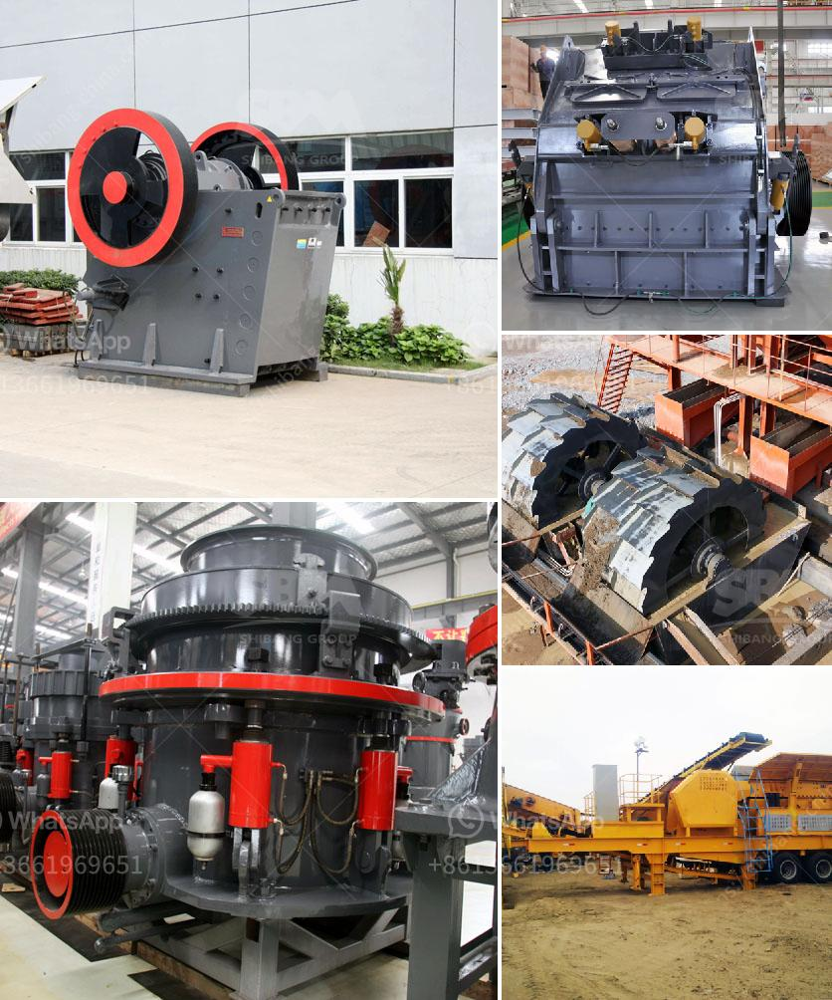

<h3>portable stone crusher machine usa</h3>
Portable stone crusher machines in USA have been selling well for a number of years, and are suitable for a variety of uses. The machines can crush stones of all types and sizes. The portable stone crusher machines in USA can be used as primary crushers or secondary crushers depending on the application. Our machines are designed to offer maximum mobility without compromising on productivity and durability.

Portable stone crusher machines are ideal for jobsites where space is limited, such as in urban areas, road construction, and underground mining applications. They can be easily transported from one location to another, reducing the need for expensive transportation and ensuring quick setup and dismantling at the worksite.

One of the key features of portable stone crusher machines in USA is their mobility. They can be easily moved to different job sites, which makes them highly versatile. This flexibility allows contractors to take advantage of opportunities in different locations and reduces downtime due to transportation delays.

Another important factor to consider when choosing portable stone crusher machines in USA is the power source for the machines. Most mobile crushers use either electricity or diesel fuel to operate. Electricity is generally more cost-effective and offers a cleaner and quieter operation. On the other hand, diesel-powered machines offer higher torque and greater crushing capacity, which is advantageous for larger jobsites.

In addition to their mobility and power source, portable stone crusher machines in USA also offer a wide range of crushing capabilities. Depending on the model, these machines can process a variety of stone materials, including limestone, granite, marble, and more. This versatility allows contractors to use the machine for multiple applications without the need for additional equipment.

The maintenance of portable stone crusher machines in USA is relatively simple and cost-effective. Regular maintenance includes cleaning and lubricating the machine, checking for wear and tear, and replacing damaged parts. Regular maintenance ensures that the machine operates smoothly and efficiently, prolonging its lifespan and reducing downtime.

When purchasing portable stone crusher machines in USA, it is important to choose a reputable manufacturer. A reliable manufacturer will provide quality machines that meet industry standards and offer excellent customer support. It is also important to consider the warranty and after-sales service offered by the manufacturer, as this can affect the overall value and performance of the machine.

In conclusion, portable stone crusher machines in USA offer numerous benefits and advantages to contractors and other users. They offer mobility, flexibility, and a wide range of crushing capabilities, making them ideal for various applications. When purchasing a portable stone crusher machine, it is important to consider factors such as mobility, power source, and maintenance requirements. By choosing a reputable manufacturer and following proper maintenance procedures, users can ensure the reliable performance and durability of the machines.
<h3>Contact us</h3><ul><li><strong>Whatsapp:&nbsp;<a href="https://wa.me/8613661969651">+8613661969651</a></strong></li><li><a href="https://swt.shibang-china.com/?git&amp;zhl&amp;portable stone crusher machine usa"><strong>Online Service(chat now)</strong></a></li></ul><h3>Related</h3><ul><li><a href='german made jaw crusher prices.md'>german made jaw crusher prices</a></li><li><a href='how to calculate grinding media in cement mill.md'>how to calculate grinding media in cement mill</a></li><li><a href='feldspar crusher for sale.md'>feldspar crusher for sale</a></li><li><a href='vibrating screen efficiency.md'>vibrating screen efficiency</a></li><li><a href='crusher plants in sri lanka.md'>crusher plants in sri lanka</a></li></ul>