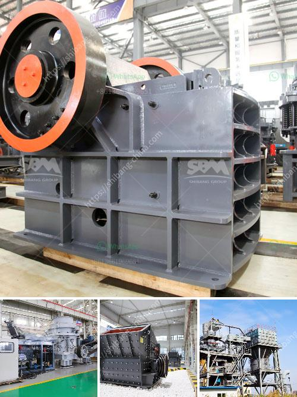

<h3>portable stone crusher plant</h3>
Stone crushers are commonly used machines in construction industry for reducing the size of stones and other materials. They are prevalent in mining, metallurgical, building material, railway, water conservancy, chemical and other industries. A portable stone crusher plant is a unique and intelligent piece of equipment designed to help mining or construction businesses run more efficiently. It is efficient in crushing materials like limestone, river stone, granite, basalt, andesite, iron ore, manganese ore, coal, silica sand, quartz sand, etc.

Portable stone crusher plant has the advantages of short work time, high degree of automation, low operation cost, high crushing efficiency, energy saving, large output, fewer pollution and easy maintenance. It is an ideal option for customers looking for portable construction waste crushing plant and construction waste crusher.

The powerful portable crusher plant can handle hard abrasive materials and can be configured as a complete production line. Due to its easy portability and relocation, the portable plant can be moved to different mining sites to complete projects, so it saves time and money for users. Mobility is one of the main factors that distinguish portable stone crushing plants from stationary ones.

Portable stone crushers are widely used in the crushing process of granite, basalt, limestone, shale, river pebble, cement clinker, quartz stone, iron ore, bauxite and other minerals. They can crush hard materials, but can't be rubbed and shaped at will. The finished product tends to be a cube, granular shape, or even no tension and crack. The utilities of portable stone crusher plants are manifold.

Portable stone crusher plants are mainly used for the production of high-quality sand and stone aggregates for the construction industry. They mainly produce crushed stone and sand, which are used in road construction, building construction, railway construction and others. In addition to the construction industry, the demand for stone aggregates in agricultural, metallurgical and power industries is also increasing rapidly.

The portable stone crusher plant is more efficient than the stationary crusher plant in terms of cost. After several comparisons, the final cost-effectiveness was considered, and the portable crusher plant was chosen as the preferred equipment. In terms of factors such as price, concrete performance, and environmental protection, the portable crushing plant is more suitable for the application of the portable stone crusher plant in urban areas.

Portable stone crusher plants have been widely developed all over the world. Crushing is integral and primary stage in dolomite quarrying process. According to the customers’ specifications and the specific flotation requirements, the portable stone crusher plant can be designed with different production capacity, such as 5-30tph, 10-50tph, 20-80tph, 30-80tph, 80-200tph, 150-250tph, etc. The portable crushing plant has clear profitability advantages.

In summary, it is a well-designed and optimized equipment that customers like. It is a combination of primary crushing and secondary crushing, featuring stable operation, easy maintenance, low cost, flexible configuration, convenient maintenance, economical and practical. It is widely used in various industries, especially in mining, construction, metallurgy, highway construction, railway construction, and water conservancy projects. The portable stone crusher plant is a very useful equipment in mining industry and construction industry.
<h3>Contact us</h3><ul><li><strong>Whatsapp:&nbsp;<a href="https://wa.me/8613661969651">+8613661969651</a></strong></li><li><a href="https://swt.shibang-china.com/?git&amp;zhl&amp;portable stone crusher plant"><strong>Online Service(chat now)</strong></a></li></ul><h3>Related</h3><ul><li><a href='pulveriser quartzite china make.md'>pulveriser quartzite china make</a></li><li><a href='machinery needed for limestone extraction.md'>machinery needed for limestone extraction</a></li><li><a href='grinding in vertical roller mill.md'>grinding in vertical roller mill</a></li><li><a href='conveyor belts price.md'>conveyor belts price</a></li><li><a href='vertical roller mill maintenance pdf.md'>vertical roller mill maintenance pdf</a></li></ul>